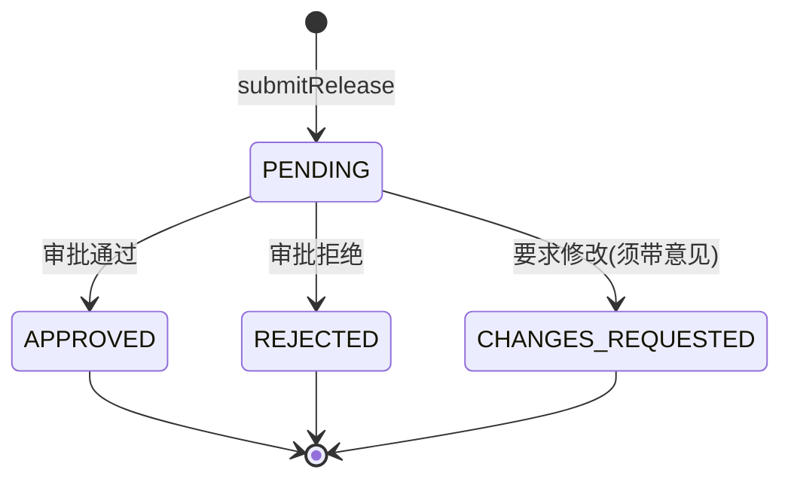
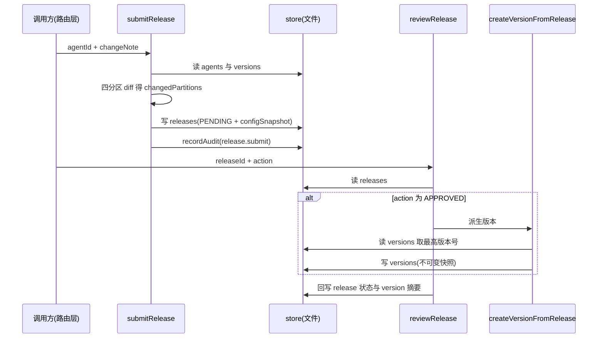

# release-service

> 深度：core（分量分 0.633）。评分未达 0.7 的 core 阈值，此处为人工升档：发布与回滚是配置生效的唯一命脉，错一条数据即改变线上 Agent 行为，且横向耦合 versioning、audit-service、diff 三个模块，故按升档条款升入 core。

## 职责

`apps/web/lib/services/release-service.ts` 承载 Agent 配置的发布流水线，四个导出函数各管一段：

1. `submitRelease`：把 Agent 当前 4 分区配置（prompt / knowledge / tools / routing）与最近一次已发布 Version 的快照做真实 diff，产出 PENDING 状态的 Release（[release-service.ts:78](apps/web/lib/services/release-service.ts#L78)）
2. `reviewRelease`：审批 PENDING Release；仅 APPROVED 派生不可变 Version（[release-service.ts:138](apps/web/lib/services/release-service.ts#L138)）
3. `createRollbackRelease`：整版本回滚——把历史快照覆盖回 Agent 当前配置，并立即派生新 Version（[release-service.ts:255](apps/web/lib/services/release-service.ts#L255)）
4. `listReleases`：按 agent 与状态列出 Release（[release-service.ts:343](apps/web/lib/services/release-service.ts#L343)）

它不直接修改运行时行为；真正让配置生效的是「审批通过 → 生成 Version → 回滚时把 Version 快照写回 agent 配置」这条链。

## 设计原理

**提交与审批解耦，快照与版本号分离。** 提交时就把 4 分区配置固化成 `configSnapshot`（[release-service.ts:99-105](apps/web/lib/services/release-service.ts#L99-L105)），审批时才基于"当时的最高版本号"计算新版本号并落 Version（[release-service.ts:191-229](apps/web/lib/services/release-service.ts#L191-L229)）。两步读写的是同一份 Release 文件，状态机如下：

三个终态都不可再变，重复审批直接抛 ConflictError（[release-service.ts:145-147](apps/web/lib/services/release-service.ts#L145-L147)）。

**diff 基线是"最近已发布 Version"，不是"上一条 Release"。** 基线选取按 publishedAt 倒序取第一条（[release-service.ts:36-43](apps/web/lib/services/release-service.ts#L36-L43)）；分区级变更判定用 `computeJsonDiff` 的 added/removed/changed 三桶非空判断（[release-service.ts:56-68](apps/web/lib/services/release-service.ts#L56-L68)）。四分区都没有真实变更时拒绝提交（[release-service.ts:95-97](apps/web/lib/services/release-service.ts#L95-L97)）。

**版本号语义集中在 versioning 模块。** 升版规则显式写成常量与分支：首次发布 0.1.0；ROUTING 分区变更或 ≥2 个分区变更升 minor；单个非路由分区升 patch；永不自动 major（[versioning.ts:7-13](apps/web/lib/versioning.ts#L7-L13)、[versioning.ts:63-68](apps/web/lib/versioning.ts#L63-L68)）。头注释交代了动因：此前 release-service 把 major/patch 硬编码为 0、只递增 minor，无法表达"小修 vs 大改"（[versioning.ts:1-6](apps/web/lib/versioning.ts#L1-L6)）。

## 关键决策

| # | 决策 | 动因与证据 |
|---|------|-----------|
| 1 | changedPartitions 走真实 diff，而非"配置存在即算变更" | 提交函数 docstring 自述"关键修复"（[release-service.ts:70-77](apps/web/lib/services/release-service.ts#L70-L77)）；测试固化行为：种子版本缺 knowledge 快照时，重新提交的 changedPartitions 严格等于 `["KNOWLEDGE"]`（[release-service.test.ts:67-92](apps/web/lib/__tests__/release-service.test.ts#L67-L92)） |
| 2 | 无变更拒绝提交 | 避免无意义 release（[release-service.ts:95-97](apps/web/lib/services/release-service.ts#L95-L97)）；测试覆盖 ValidationError（[release-service.test.ts:30-54](apps/web/lib/__tests__/release-service.test.ts#L30-L54)） |
| 3 | configSnapshot 恒写入 | 修复种子数据 rel-001 "configSnapshot 为 null 却 APPROVED" 的矛盾（[release-service.ts:76](apps/web/lib/services/release-service.ts#L76)），落点在 [release-service.ts:99-105](apps/web/lib/services/release-service.ts#L99-L105) |
| 4 | 重复审批抛 ConflictError | 此前是含糊的裸 Error，docstring 明确列为修复项（[release-service.ts:129-137](apps/web/lib/services/release-service.ts#L129-L137)）；测试（[release-service.test.ts:156-162](apps/web/lib/__tests__/release-service.test.ts#L156-L162)） |
| 5 | CHANGES_REQUESTED 必须带审批意见 | 校验在 [release-service.ts:148-150](apps/web/lib/services/release-service.ts#L148-L150)，测试（[release-service.test.ts:138-143](apps/web/lib/__tests__/release-service.test.ts#L138-L143)） |
| 6 | 取"最高版本号"按三段数值比较，而非只看 minor | 代码内注释直接点明（[release-service.ts:199-202](apps/web/lib/services/release-service.ts#L199-L202)），配套手写比较器 `compareSemVer`（[release-service.ts:231-239](apps/web/lib/services/release-service.ts#L231-L239)） |
| 7 | 整版本回滚不走 PENDING 审批流 | docstring 给出取舍：回滚是紧急恢复而非新增变更，直接以 APPROVED 状态落盘（[release-service.ts:241-254](apps/web/lib/services/release-service.ts#L241-L254)、[release-service.ts:293-312](apps/web/lib/services/release-service.ts#L293-L312)），并打 `isRollback` 标记（[release-service.ts:308-310](apps/web/lib/services/release-service.ts#L308-L310)） |
| 8 | 回滚立即派生新 Version，保证历史快照不可变 | docstring 注明"版本号自增，确保历史快照不可变"（[release-service.ts:247](apps/web/lib/services/release-service.ts#L247)），落点在 [release-service.ts:314-323](apps/web/lib/services/release-service.ts#L314-L323) |

## 依赖

本模块的 import 全集见 [release-service.ts:1-11](apps/web/lib/services/release-service.ts#L1-L11)：

| 依赖 | 用途 |
|------|------|
| `@/lib/data/store` | 唯一持久层：读 agents / versions / releases，写 release 与 version 文件 |
| `@/lib/context`（getActor） | 操作者身份，写入 submittedBy / publishedBy / approvedBy（[context.ts:1-9](apps/web/lib/context.ts#L1-L9)） |
| `@/lib/errors` | NotFoundError / ValidationError / ConflictError 三类业务异常（[errors.ts:1-6](apps/web/lib/errors.ts#L1-L6)） |
| `@/lib/services/audit-service`（recordAudit） | 唯一的横向服务依赖：submit / approve / reject / changes_requested / agent.rollback 五个动作各记一条审计（[release-service.ts:125](apps/web/lib/services/release-service.ts#L125)、[release-service.ts:179-182](apps/web/lib/services/release-service.ts#L179-L182)、[release-service.ts:328-334](apps/web/lib/services/release-service.ts#L328-L334)），详见 [audit-service.md](audit-service.md) |
| `@/lib/diff`（computeJsonDiff） | 分区级变更判定 |
| `@/lib/versioning` | bumpVersion / formatVersion / Partition / SemVer |

反向依赖（谁调用本服务）：

| 调用方 | 说明 |
|--------|------|
| POST /api/agents/[id]/release | 提交发布，withActor 包裹 service 调用（[route.ts:17-18](apps/web/app/api/agents/[id]/release/route.ts#L17-L18)） |
| PUT /api/releases/[id]/review | 审批权威入口，path 的 id 即 releaseId（[route.ts:8-9](apps/web/app/api/releases/[id]/review/route.ts#L8-L9)、[route.ts:21-22](apps/web/app/api/releases/[id]/review/route.ts#L21-L22)） |
| PUT /api/agents/[id]/release | 向后兼容的审批端点，releaseId 取自 body（[route.ts:26-32](apps/web/app/api/agents/[id]/release/route.ts#L26-L32)） |
| POST /api/agents/[id]/rollback/[versionId] | 整版本回滚（[route.ts:30](apps/web/app/api/agents/[id]/rollback/[versionId]/route.ts#L30)） |

## 暴露接口

| 函数 | 签名要点 | 行为摘要 |
|------|---------|---------|
| `submitRelease(agentId, changeNote)` | 异步 | 校验 agent 存在 → 四分区 diff → 写 PENDING release + configSnapshot → 记审计；返回值附 agent 名称（[release-service.ts:23-26](apps/web/lib/services/release-service.ts#L23-L26)） |
| `reviewRelease(releaseId, action, reviewComment?)` | action 三选一 | 终态判定 → 意见校验 → APPROVED 时派生 Version 并回填摘要（[release-service.ts:162-169](apps/web/lib/services/release-service.ts#L162-L169)） |
| `createRollbackRelease(agentId, targetVersionId)` | 异步 | 覆盖 4 分区 → APPROVED release → 派生新 Version → 记审计；返回 `{ release, version, restoredFrom }`（[release-service.ts:336-340](apps/web/lib/services/release-service.ts#L336-L340)） |
| `listReleases(agentId, status?)` | 同步语义 | 按 submittedAt 倒序（[release-service.ts:352-353](apps/web/lib/services/release-service.ts#L352-L353)）；注意其调用方见已知坑第 3 条 |

## 数据流

提交 → 审批 → 版本落盘的主线：

回滚的数据流（文字描述）：读目标 Version 并校验归属（[release-service.ts:259-263](apps/web/lib/services/release-service.ts#L259-L263)）→ 把 4 个分区快照逐个剥离 version/lastModifiedAt 字段后覆盖 agent 当前配置并写回（[release-service.ts:279-291](apps/web/lib/services/release-service.ts#L279-L291)）→ 构造 APPROVED release → 立即派生新 Version → 落 release 文件 → 记 `agent.rollback` 审计（[release-service.ts:328-334](apps/web/lib/services/release-service.ts#L328-L334)）。

## 排查指南

| 症状 | 先看哪里 |
|------|---------|
| 提交报 422"没有任何配置变更，无法提交发布" | 三桶 diff 全空（[release-service.ts:56-68](apps/web/lib/services/release-service.ts#L56-L68)）；基线是最近已发布版本快照（[release-service.ts:28-54](apps/web/lib/services/release-service.ts#L28-L54)）。刚回滚过就提交会被拒——当前配置与快照一致，属预期行为 |
| 审批报 409"该 Release 已处理" | status 非 PENDING 即拒绝（[release-service.ts:145-147](apps/web/lib/services/release-service.ts#L145-L147)） |
| CHANGES_REQUESTED 报 422 | reviewComment 为空或纯空白（[release-service.ts:148-150](apps/web/lib/services/release-service.ts#L148-L150)） |
| 版本号与预期不符 | 对照 bumpVersion 规则表（[versioning.ts:46-69](apps/web/lib/versioning.ts#L46-L69)）：ROUTING 变更或 ≥2 分区升 minor；单分区升 patch；全 4 分区也是 minor 而非 major |
| 回滚后 agent 配置未变 | 目标 Version 的 4 个快照字段为空时兜底为空对象（[release-service.ts:283-284](apps/web/lib/services/release-service.ts#L283-L284)）；路由入口在 [route.ts:30](apps/web/app/api/agents/[id]/rollback/[versionId]/route.ts#L30) |
| 审计日志缺一条 | recordAudit 是 fire-and-forget，审计写失败只打日志不阻塞业务（[audit-service.ts:33-36](apps/web/lib/services/audit-service.ts#L33-L36)、[audit-service.ts:55-65](apps/web/lib/services/audit-service.ts#L55-L65)），详见 [audit-service.md](audit-service.md) |

## 已知坑

1. **快照与版本号解耦，乱序审批时时间线错位。** configSnapshot 在提交时固化（[release-service.ts:99-105](apps/web/lib/services/release-service.ts#L99-L105)），版本号在审批时基于"当时的最高版本"计算（[release-service.ts:199-204](apps/web/lib/services/release-service.ts#L199-L204)）。两条 PENDING release 若乱序审批，后审批者版本号更大，但其配置内容是更早提交的——版本历史的时间线与配置内容的时间线不保证一致。
2. **回滚不回退版本号。** 回滚派生的新版本继续自增（[release-service.ts:314-318](apps/web/lib/services/release-service.ts#L314-L318)），版本历史里会出现"0.3.0 的内容等于 0.1.0"。这是保历史不可变的刻意设计（[release-service.ts:247](apps/web/lib/services/release-service.ts#L247)），排查时不要找"版本号回退"。
3. **`listReleases` 无生产调用方。** 全仓库检索只剩定义处（[release-service.ts:343-354](apps/web/lib/services/release-service.ts#L343-L354)）；GET /api/releases 在路由层内联重复实现了同款过滤排序（[route.ts:13-17](apps/web/app/api/releases/route.ts#L13-L17)）。改列表逻辑时两处需人工同步，否则行为漂移。
4. **SemVer 解析双实现并存。** `compareSemVer` 把非法版本视为 0.0.0（[release-service.ts:232-234](apps/web/lib/services/release-service.ts#L232-L234)），`parseVersion` 把非法版本返回 null、进而按首次发布处理（[versioning.ts:28-34](apps/web/lib/versioning.ts#L28-L34)、[versioning.ts:50-51](apps/web/lib/versioning.ts#L50-L51)）。对脏数据的容错语义不同，修一处不代表另一处。
5. **版本历史路由全量返回。** GET /api/agents/[id]/versions 不分页（[route.ts:22-31](apps/web/app/api/agents/[id]/versions/route.ts#L22-L31)），而版本数只增不减（回滚也新增版本），长期运行的 agent 该响应会持续变大。
