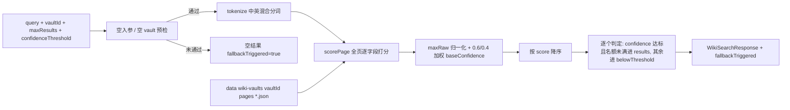

# retrieval-service

> 深度：standard（分量分 0.339）

## 职责

`apps/web/lib/services/retrieval-service.ts` 是知识库的 BM25-lite 本地文本检索服务，意图是对某个 wiki vault 的页面做关键词检索，为 Agent 试聊与评测重放提供知识上下文（头注释 [retrieval-service.ts:4-5](apps/web/lib/services/retrieval-service.ts#L4-L5)）。对外只暴露一个入口 `searchWiki`（[retrieval-service.ts:140](apps/web/lib/services/retrieval-service.ts#L140)），加两个可复用的纯函数 tokenize（[retrieval-service.ts:50](apps/web/lib/services/retrieval-service.ts#L50)）与内部的打分实现。

**重要现状：该服务在生产代码中零调用。** 全仓库唯一的 import 来自测试文件（[retrieval-service.test.ts:6](apps/web/lib/__tests__/retrieval-service.test.ts#L6)），头注释与 searchWiki docstring 声称的"在 agent 的试聊流程和评测重放中调用"（[retrieval-service.ts:134-139](apps/web/lib/services/retrieval-service.ts#L134-L139)）与实际不符——见已知坑第 1 条。

## 设计原理

**BM25-lite：有 tf 饱和、无 IDF。** 头注释列出四条设计决策（[retrieval-service.ts:7-11](apps/web/lib/services/retrieval-service.ts#L7-L11)）：分词、字段加权、confidence 加权、阈值过滤。实现上用 tfSat 做饱和（tf/(tf+1.2)，[retrieval-service.ts:71-73](apps/web/lib/services/retrieval-service.ts#L71-L73)），但不维护语料统计（无倒排索引、无 IDF），每页对查询 token 逐一扫描四个字段（[retrieval-service.ts:118-132](apps/web/lib/services/retrieval-service.ts#L118-L132)）。

**中英混合分词。** tokenize 先全小写、再按"连续 CJK / 连续拉丁数字"切段（[retrieval-service.ts:51-54](apps/web/lib/services/retrieval-service.ts#L51-L54)）；CJK 段拆成单字加相邻双字 bigram（[retrieval-service.ts:56-62](apps/web/lib/services/retrieval-service.ts#L56-L62)），拉丁段保留整词（[retrieval-service.ts:63-65](apps/web/lib/services/retrieval-service.ts#L63-L65)）。计数端与之配套：长度不大于 2 的 token 走子串计数（[retrieval-service.ts:77-86](apps/web/lib/services/retrieval-service.ts#L77-L86)），拉丁词走词边界正则（[retrieval-service.ts:88-89](apps/web/lib/services/retrieval-service.ts#L88-L89)）——tokenize 产出的拉丁段只含 `[a-z0-9]+`，所以拼进 RegExp（[retrieval-service.ts:88](apps/web/lib/services/retrieval-service.ts#L88)）没有注入面。

**检索分归一化后与页面置信度加权。** 打分按字段加权累计：title ×3、tags ×2、summary ×1、content ×0.5（[retrieval-service.ts:126-129](apps/web/lib/services/retrieval-service.ts#L126-L129)）；然后用本 vault 本次查询的最高分把原始分归一到 0-1（[retrieval-service.ts:158-160](apps/web/lib/services/retrieval-service.ts#L158-L160)），再与页面自带的 baseConfidence 按 0.6/0.4 加权得到最终 confidence（[retrieval-service.ts:165](apps/web/lib/services/retrieval-service.ts#L165)）。

**失败表达全靠返回值，不抛错。** 空入参（[retrieval-service.ts:143-145](apps/web/lib/services/retrieval-service.ts#L143-L145)）、空 vault（[retrieval-service.ts:147-150](apps/web/lib/services/retrieval-service.ts#L147-L150)）、零命中（[retrieval-service.ts:200](apps/web/lib/services/retrieval-service.ts#L200)）三种情况都返回结构化空结果且 `fallbackTriggered: true`——调用方据此降级，而不是接异常。

## 关键决策

| # | 决策 | 动因与证据 |
|---|------|-----------|
| 1 | BM25-lite 而非完整 BM25 / 向量检索 | 无 IDF、无索引的轻量实现（[retrieval-service.ts:71-73](apps/web/lib/services/retrieval-service.ts#L71-L73)、[retrieval-service.ts:118-132](apps/web/lib/services/retrieval-service.ts#L118-L132)），头注释自称 "lite" |
| 2 | CJK 单字 + bigram 混合分词 | 单字保召回、bigram 保区分度（[retrieval-service.ts:58-61](apps/web/lib/services/retrieval-service.ts#L58-L61)），头注释 [retrieval-service.ts:8](apps/web/lib/services/retrieval-service.ts#L8) |
| 3 | 字段权重 title > tags > summary > content | 标题命中最可信、正文命中最弱（[retrieval-service.ts:126-129](apps/web/lib/services/retrieval-service.ts#L126-L129)） |
| 4 | 检索分与 baseConfidence 0.6/0.4 加权 | 检索相关性为主、页面先验质量为辅（[retrieval-service.ts:165](apps/web/lib/services/retrieval-service.ts#L165)，头注释 [retrieval-service.ts:10](apps/web/lib/services/retrieval-service.ts#L10)） |
| 5 | 结果与落选双数组返回 | 达标进 results 并标 usedInContext，未达标进 belowThreshold（[retrieval-service.ts:186-190](apps/web/lib/services/retrieval-service.ts#L186-L190)），给调用方完整的决策依据 |

## 依赖

import 全集三项（[retrieval-service.ts:13-15](apps/web/lib/services/retrieval-service.ts#L13-L15)）：fs 三函数（readdirSync/readFileSync/existsSync）、join、`_getDataDir`——**第三项 import 后从未使用**（坑 2），实际读文件硬编码 `process.cwd()/data`（[retrieval-service.ts:104](apps/web/lib/services/retrieval-service.ts#L104)）。零 store API、零 audit、零错误体系、零 actor。

反向依赖（全部调用点）：

| 调用方 | 函数 | 锚点 |
|--------|------|------|
| lib/__tests__/retrieval-service.test.ts | searchWiki（唯一调用方） | [retrieval-service.test.ts:6](apps/web/lib/__tests__/retrieval-service.test.ts#L6) |

数据面：只读 `data/wiki-vaults/<vaultId>/pages/*.json`（与 wiki-service 的 page 存储共享物理布局），不写任何文件。

## 暴露接口

| 函数/类型 | 签名要点 | 行为摘要 |
|------|---------|---------|
| `tokenize(text)` | 纯函数 | 全小写；CJK 单字+bigram、拉丁整词（[retrieval-service.ts:50-68](apps/web/lib/services/retrieval-service.ts#L50-L68)） |
| `searchWiki(params)` | query/vaultId/maxResults/confidenceThreshold 必填 | 返回 WikiSearchResponse：results（usedInContext=true）+ belowThreshold + candidates + fallbackTriggered（[retrieval-service.ts:194-201](apps/web/lib/services/retrieval-service.ts#L194-L201)）；永不抛错 |

响应字段语义：candidates 是参与打分的页面数（[retrieval-service.ts:197](apps/web/lib/services/retrieval-service.ts#L197)）；excerpt 固定取 content 前 400 字符（[retrieval-service.ts:182](apps/web/lib/services/retrieval-service.ts#L182)）；strategy 恒为 "BM25_LITE"。

## 数据流

## 排查指南

| 症状 | 先看哪里 |
|------|---------|
| 想在试聊/评测里启用知识检索 | 该服务尚未接线：试聊路由不 import 它（坑 1），需自行在调用方接入 searchWiki 并消费 usedInContext 的页面 |
| 某个明明存在的页面检索不出来 | 该页 JSON 损坏时 loadPages 静默跳过（[retrieval-service.ts:109-114](apps/web/lib/services/retrieval-service.ts#L109-L114)，坑 3）；先校验文件可解析 |
| 同一查询在不同 vault 表现差异大 | 归一化是 vault 内相对分（[retrieval-service.ts:158-160](apps/web/lib/services/retrieval-service.ts#L158-L160)，坑 5），confidenceThreshold 的实际松紧随语料漂移 |
| belowThreshold 里出现 confidence 达标的页面 | 排序按 score、准入按 confidence（[retrieval-service.ts:170](apps/web/lib/services/retrieval-service.ts#L170) vs [retrieval-service.ts:186](apps/web/lib/services/retrieval-service.ts#L186)，坑 4）；名额被 score 靠前但 baseConfidence 低的页面占掉 |
| 大 vault 检索慢 | 无索引全页扫描，每 token 每页扫四个字段（[retrieval-service.ts:126-129](apps/web/lib/services/retrieval-service.ts#L126-L129)，坑 6） |
| 自定义数据根后检索不到数据 | loadPages 硬编码 `process.cwd()/data`（[retrieval-service.ts:104](apps/web/lib/services/retrieval-service.ts#L104)，坑 2） |

## 已知坑

1. **生产代码零调用，docstring 声称的调用方不存在。** 头注释与 searchWiki docstring 都说"在 agent 的试聊流程和评测重放中调用"（[retrieval-service.ts:4-5](apps/web/lib/services/retrieval-service.ts#L4-L5)、[retrieval-service.ts:137-138](apps/web/lib/services/retrieval-service.ts#L137-L138)），但全仓库唯一 import 是测试文件（[retrieval-service.test.ts:6](apps/web/lib/__tests__/retrieval-service.test.ts#L6)）——试聊路由（agents/[id]/chat）并未引用本模块。整套 BM25 检索是"已建成、未接线"状态，读代码时不要被 docstring 误导架构现状。
2. **import 了 `_getDataDir` 却硬编码数据根。** [retrieval-service.ts:15](apps/web/lib/services/retrieval-service.ts#L15) 从 store 导入 `_getDataDir` 但正文从未调用，loadPages 写死 `join(process.cwd(), "data", ...)`（[retrieval-service.ts:104](apps/web/lib/services/retrieval-service.ts#L104)）——与 wiki-service 的 deleteVault（见 [wiki-service.md](wiki-service.md) 已知坑 1）同款绕过 dataDirOverride 问题，且留着一个未使用的 import 暴露了本意。
3. **损坏页面静默消失于检索结果。** loadPages 对 JSON.parse 失败 catch 后返回 null 再过滤（[retrieval-service.ts:109-114](apps/web/lib/services/retrieval-service.ts#L109-L114)）——与 wiki-service 的 listPages 遇坏文件抛错（见 [wiki-service.md](wiki-service.md) 已知坑 4）策略相反；坏页面不参与检索也不产生任何日志或 candidates 计数，知识覆盖面悄悄缩水。
4. **排序键与准入键不一致。** 页面按 score 降序排列（[retrieval-service.ts:170](apps/web/lib/services/retrieval-service.ts#L170)），但进 results 的判定用 confidence（[retrieval-service.ts:186](apps/web/lib/services/retrieval-service.ts#L186)）——score 靠前但 baseConfidence 偏低的页面先消耗 maxResults 名额，score 更低但 base 高的页面即使 confidence 达标也会被挤进 belowThreshold（[retrieval-service.ts:190](apps/web/lib/services/retrieval-service.ts#L190)）。belowThreshold 因此混有"达标但超额"的页面，与字段名暗示的"低于阈值"语义不符。
5. **confidence 是 vault 内相对分，跨库不可比。** 归一化基准是本次查询在本 vault 的最高分（[retrieval-service.ts:158-160](apps/web/lib/services/retrieval-service.ts#L158-L160)）——同一个 confidenceThreshold 在小库、大库、内容变化后的库上松紧不同；用固定阈值做多 vault 统一过滤时语义会漂移。
6. **无索引，纯线性扫描。** 每次检索对全部页面、每页对每个查询 token 扫 title/tags/summary/content 四个字段的全文（[retrieval-service.ts:125-129](apps/web/lib/services/retrieval-service.ts#L125-L129)），CJK bigram 还会让 token 数约为字数的两倍（[retrieval-service.ts:58-61](apps/web/lib/services/retrieval-service.ts#L58-L61)）——页面数或查询长度增长时成本线性恶化，当前规模无碍，接线上量前需重估。
