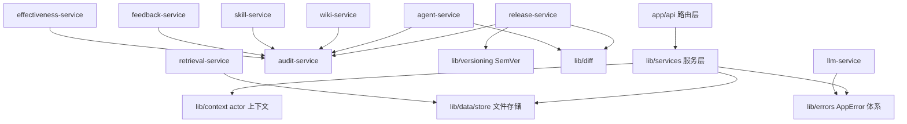
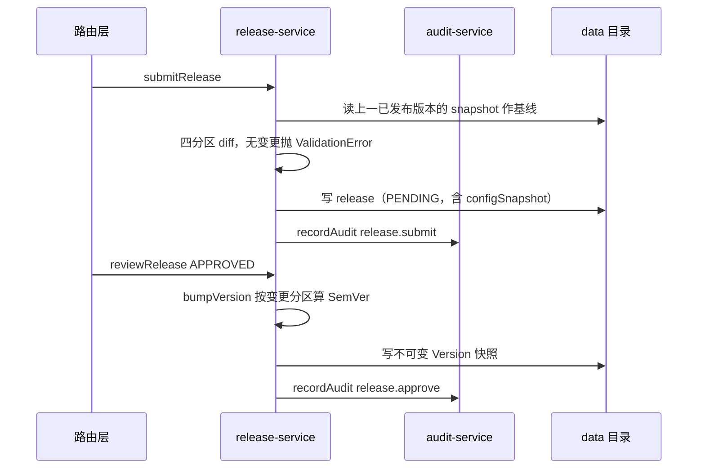

# apps/web 服务层（lib/services）架构

> 深度：standard（分量分 0.600，assess_components.py 对目录组件的直接评分）

本文是 `apps/web/lib/services/` 模块级总览：该层在 Next.js 应用中的位置、9 个服务的分工、服务间与层外的依赖方向，以及全层共享的四条契约。各服务的细节见对应组件文档。

## 边界图

服务层夹在 `app/api` 路由层与 `lib` 基础设施之间：路由层只做参数校验与 actor 装配，业务规则全部下沉到服务层；服务层不感知 HTTP，只依赖 store、context、errors 等纯基础设施。下图的边只画直接 import。

六个服务 import [audit-service.ts:4](apps/web/lib/services/audit-service.ts#L4) 导出的 `recordAudit`（agent/wiki/skill/feedback/release/effectiveness，锚点分别在 [agent-service.ts:4](apps/web/lib/services/agent-service.ts#L4)、[wiki-service.ts:5](apps/web/lib/services/wiki-service.ts#L5)、[skill-service.ts:4](apps/web/lib/services/skill-service.ts#L4)、[feedback-service.ts:4](apps/web/lib/services/feedback-service.ts#L4)、[release-service.ts:4](apps/web/lib/services/release-service.ts#L4)、[effectiveness-service.ts:2](apps/web/lib/services/effectiveness-service.ts#L2)）——audit-service 是全层唯一被横向依赖的服务，也因此是被引用次数最多的文件。`llm-service` 是唯一不碰 store 的服务，仅依赖 [llm-service.ts:9](apps/web/lib/services/llm-service.ts#L9) 的错误体系。

九个服务的分工与文档入口：

| 服务 | 一句话职责 | 组件文档 |
|------|-----------|---------|
| release-service | 发布提交/审批/整版本回滚，releases 与 versions 两个集合的唯一写入口 | [release-service.md](release-service.md) |
| agent-service | Agent 实体 CRUD（软删除）与四分区配置草稿读写 | [agent-service.md](agent-service.md) |
| wiki-service | 知识库 Vault 与 Page 管理，含唯一的物理删除操作 | [wiki-service.md](wiki-service.md) |
| skill-service | Skill 资产与 Agent 绑定（绑定内嵌于 agent 记录） | [skill-service.md](skill-service.md) |
| feedback-service | 反馈收集与八状态流转（白名单状态机） | [feedback-service.md](feedback-service.md) |
| audit-service | 全局 append-only 审计流（fire-and-forget） | [audit-service.md](audit-service.md) |
| llm-service | MiMo 网关：无状态 chatCompletion，三档结构化错误 | [llm-service.md](llm-service.md) |
| retrieval-service | wiki 页面的 BM25-lite 本地检索 | [retrieval-service.md](retrieval-service.md) |
| effectiveness-service | 版本效果报告的懒计算与幂等写回 | [effectiveness-service.md](effectiveness-service.md) |

## 数据流

平台主线是"改配置 → 发版 → 收反馈 → 再改"的改进环。发布主线的调用顺序：

- 配置草稿改动由 agent-service 落盘并记 [config-changes](agent-service.md)（diff 明细）。
- 反馈进入 feedback-service 的状态机；反馈的 LLM 归因与版本效果聚合分别由 [llm-service.md](llm-service.md)（[insight route.ts:8](apps/web/app/api/feedback/[id]/insight/route.ts#L8)）与 [effectiveness-service.md](effectiveness-service.md)（[versions route.ts:35](apps/web/app/api/agents/[id]/versions/route.ts#L35)）承接。
- 试聊走 chat 路由直接调 llm-service（[chat route.ts:6](apps/web/app/api/agents/[id]/chat/route.ts#L6)）；retrieval-service 当前只被测试引用，详见[该文档的已知事实](retrieval-service.md)。

## 模块间契约

全层共享四条约定，违反任意一条都会破坏跨服务的可预期性：

1. **错误必须走 AppError 体系**。服务层抛 [errors.ts:37](apps/web/lib/errors.ts#L37)、[errors.ts:44](apps/web/lib/errors.ts#L44)、[errors.ts:51](apps/web/lib/errors.ts#L51) 等子类，由路由层统一映射 HTTP 状态；设计动因是消除"靠字符串匹配判 404"的旧模式（[errors.ts:1-6](apps/web/lib/errors.ts#L1-L6)）。
2. **actor 一律从 context 取**。写操作通过 [context.ts:53](apps/web/lib/context.ts#L53) 的 `getActor()` 拿操作者，由路由层 [context.ts:42](apps/web/lib/context.ts#L42) 的 `withActor` 装配（装配示例见 [release route.ts:17](apps/web/app/api/agents/[id]/release/route.ts#L17)）；动因见 [context.ts:1-9](apps/web/lib/context.ts#L1-L9)——替代散落各处的硬编码 "system"。
3. **所有写操作记审计**。业务成功后调 `recordAudit`；审计自身失败不影响业务（fire-and-forget，见 [audit-service.md](audit-service.md)）。
4. **存储统一走 store**。单实体 JSON 文件 + 全量覆盖写（[store.ts:52-55](apps/web/lib/data/store.ts#L52-L55)）；损坏文件抛结构化错误而非裸异常（[store.ts:44-49](apps/web/lib/data/store.ts#L44-L49)）。wiki-service 的 pages 目录有两处绕过 store 直接用 fs 的例外，见 [wiki-service.md](wiki-service.md)。

## 演进动因

- **为什么抽服务层**：路由层保持"校验 + 装配 actor + 调服务 + 错误映射"四件事（典型形态见 [release route.ts:12-24](apps/web/app/api/agents/[id]/release/route.ts#L12-L24)），业务规则集中在服务层才可被无 HTTP 上下文的单测直接覆盖（[release-service.test.ts:23](apps/web/lib/__tests__/release-service.test.ts#L23) 起）。
- **为什么错误/actor 成体系**：errors 与 context 的头部注释各自记录了要替代的旧模式——字符串匹配判 404（[errors.ts:1-6](apps/web/lib/errors.ts#L1-L6)）与硬编码 "system"（[context.ts:1-9](apps/web/lib/context.ts#L1-L9)）。这两条动因属于代码内注释直接给出的证据。
- **版本号为什么独立成库**：release-service 曾把 major/patch 硬编码为 0、只递增 minor（[versioning.ts:1-16](apps/web/lib/versioning.ts#L1-L16) 注释原话），规则随后被抽到 versioning.ts 集中管理。
- git 提交信息在本仓库全部为 "update"，无演进叙事可考；上文的动因证据全部来自代码内注释与测试断言（每条已附锚点），其中代码内注释属于作者直接留下的动因记录，证据等级最高。
