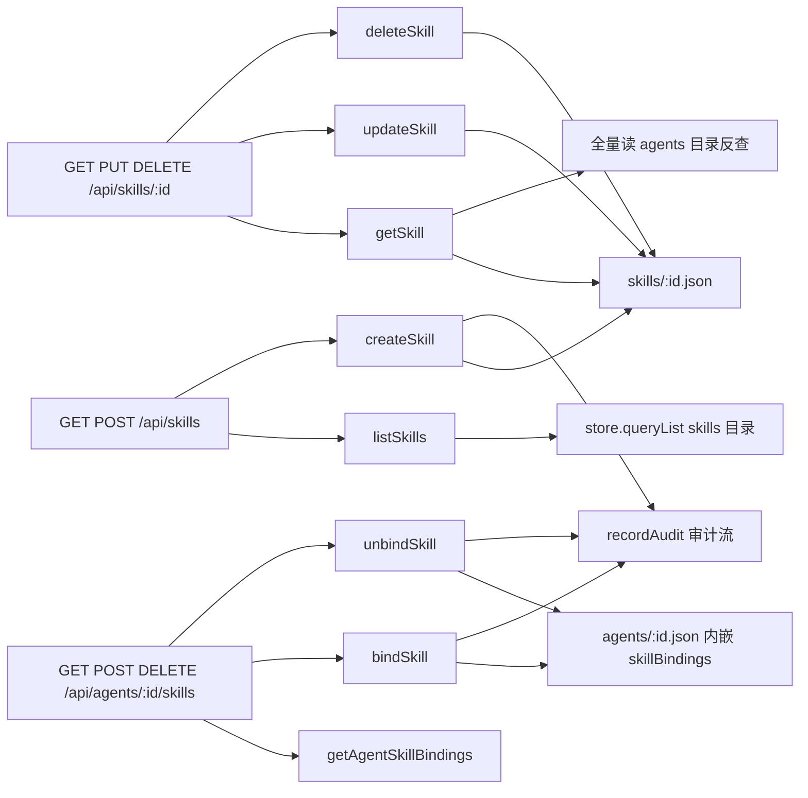

# skill-service

> 深度：standard（分量分 0.509）

## 职责

`apps/web/lib/services/skill-service.ts` 是 Agent 技能目录与技能绑定关系的领域服务，9 个导出函数分两组：

1. **Skill CRUD**：listSkills / getSkill / createSkill / updateSkill / deleteSkill（[skill-service.ts:6](apps/web/lib/services/skill-service.ts#L6)、[skill-service.ts:37](apps/web/lib/services/skill-service.ts#L37)、[skill-service.ts:63](apps/web/lib/services/skill-service.ts#L63)、[skill-service.ts:104](apps/web/lib/services/skill-service.ts#L104)、[skill-service.ts:114](apps/web/lib/services/skill-service.ts#L114)）
2. **绑定关系**：bindSkill / unbindSkill / getAgentSkillBindings / toggleSkillBinding（[skill-service.ts:124](apps/web/lib/services/skill-service.ts#L124)、[skill-service.ts:169](apps/web/lib/services/skill-service.ts#L169)、[skill-service.ts:187](apps/web/lib/services/skill-service.ts#L187)、[skill-service.ts:195](apps/web/lib/services/skill-service.ts#L195)）

核心结构特征：绑定关系不落独立存储，而是内嵌在 agent 文件的 `skillBindings` 数组里（[skill-service.ts:134](apps/web/lib/services/skill-service.ts#L134)、[skill-service.ts:158-164](apps/web/lib/services/skill-service.ts#L158-L164)）。消费方是三个路由文件：skills 列表/创建、skills 单体 CRUD、agents 下的绑定管理（见依赖节反向表）。

## 设计原理

**绑定关系随 agent 文件走，而非独立 join 表。** bindSkill 的读取与写入都以 agent 文件为容器：从 `agent.skillBindings` 取数组（[skill-service.ts:134](apps/web/lib/services/skill-service.ts#L134)），改完整体写回 agents 目录（[skill-service.ts:164](apps/web/lib/services/skill-service.ts#L164)）。这是文件存储下没有 join 能力的取舍——代价是反向查询（skill → 哪些 agent 绑了我）必须全量扫 agents 目录（[skill-service.ts:41-48](apps/web/lib/services/skill-service.ts#L41-L48)），见已知坑第 6 条。

**列表过滤与详情聚合是两条独立通路。** 列表走 store.queryList 的单文件过滤加手工分页排序（[skill-service.ts:13-34](apps/web/lib/services/skill-service.ts#L13-L34)，updatedAt 倒序 [skill-service.ts:31](apps/web/lib/services/skill-service.ts#L31)）；详情则手动聚合三个数据源——skill 本体、扫全量 agents 反查出的 bindings、skill-versions 目录的最新 10 条（[skill-service.ts:38-53](apps/web/lib/services/skill-service.ts#L38-L53)），并拼出 `_count`（[skill-service.ts:59](apps/web/lib/services/skill-service.ts#L59)）。

**删除是归档，不是物理删除。** deleteSkill 只把 status 改为 ARCHIVED 后写回（[skill-service.ts:118](apps/web/lib/services/skill-service.ts#L118)），与 agent-service 的 deleteAgent 同款软删约定——文件保留，历史绑定与版本引用不断链。

**author 与绑定人在创建时点做快照。** createSkill 把 authorId 与 authorName 一起落盘（[skill-service.ts:92-93](apps/web/lib/services/skill-service.ts#L92-L93)），bindSkill 把 boundBy 写进 binding（[skill-service.ts:150](apps/web/lib/services/skill-service.ts#L150)）——与 audit-service 固化 userName 是同一思路：历史事实不随主数据改名而变。

**默认值兜底集中在 createSkill。** category GENERAL、runtime HTTP、version 1.0.0、status DRAFT、publishedAt null、downloadCount 0 全在对象字面量里给默认（[skill-service.ts:82-91](apps/web/lib/services/skill-service.ts#L82-L91)），路由层 schema 只把少量字段标 optional。

## 关键决策

| # | 决策 | 动因与证据 |
|---|------|-----------|
| 1 | 绑定内嵌 agent 文件而非独立存储 | 文件存储无 join；写路径单文件完成（[skill-service.ts:134](apps/web/lib/services/skill-service.ts#L134)、[skill-service.ts:164](apps/web/lib/services/skill-service.ts#L164)）；代价见坑 6 |
| 2 | binding 内固化 skill 快照 | 绑定列表展示免二次读 skill 文件（[skill-service.ts:153](apps/web/lib/services/skill-service.ts#L153)）；代价见坑 5 |
| 3 | 软删 ARCHIVED | 保持绑定/版本历史引用不断链（[skill-service.ts:118](apps/web/lib/services/skill-service.ts#L118)） |
| 4 | category/status 的 "ALL" 豁免放在 service 层 | URL 传 "ALL" 与不传等价（[skill-service.ts:16-21](apps/web/lib/services/skill-service.ts#L16-L21)）；对比 feedback-service 的 tag 过滤无此豁免（见 [feedback-service.md](feedback-service.md) 已知坑 3） |
| 5 | bindSkill 做幂等 upsert | 重复绑同一 skill 不报错，而是合并 config 并重新启用（[skill-service.ts:139-142](apps/web/lib/services/skill-service.ts#L139-L142)） |

## 依赖

import 全集四项（[skill-service.ts:1-4](apps/web/lib/services/skill-service.ts#L1-L4)）：store、getActor、NotFoundError、recordAudit。

反向依赖（全部调用点）：

| 调用方 | 函数 | 锚点 |
|--------|------|------|
| app/api/skills/route.ts | listSkills / createSkill | [route.ts:14](apps/web/app/api/skills/route.ts#L14)、[route.ts:24](apps/web/app/api/skills/route.ts#L24) |
| app/api/skills/[id]/route.ts | getSkill / updateSkill / deleteSkill | [route.ts:12](apps/web/app/api/skills/[id]/route.ts#L12)、[route.ts:27](apps/web/app/api/skills/[id]/route.ts#L27)、[route.ts:41](apps/web/app/api/skills/[id]/route.ts#L41) |
| app/api/agents/[id]/skills/route.ts | getAgentSkillBindings / bindSkill / unbindSkill | [route.ts:12](apps/web/app/api/agents/[id]/skills/route.ts#L12)、[route.ts:26](apps/web/app/api/agents/[id]/skills/route.ts#L26)、[route.ts:40](apps/web/app/api/agents/[id]/skills/route.ts#L40) |
| lib/__tests__/skill-service.test.ts | toggleSkillBinding（仅测试） | [skill-service.test.ts:10](apps/web/lib/__tests__/skill-service.test.ts#L10) |

数据面：读 skills/ 与 skill-versions/ 目录、agents/ 目录（skillBindings 内嵌）；写 skills/[id].json、agents/[id].json、settings/audit-logs.json（经 recordAudit）。字段校验依赖路由层的三个 schema（createSkillSchema [schemas.ts:118-128](apps/web/lib/schemas.ts#L118-L128)、updateSkillSchema [schemas.ts:130-140](apps/web/lib/schemas.ts#L130-L140)、bindSkillSchema [schemas.ts:142-145](apps/web/lib/schemas.ts#L142-L145)）。

## 暴露接口

| 函数 | 签名要点 | 行为摘要 |
|------|---------|---------|
| `listSkills({skip,take,category?,status?,search?})` | search 匹配 name/displayName/description（[skill-service.ts:22-29](apps/web/lib/services/skill-service.ts#L22-L29)） | queryList 过滤+分页，updatedAt 倒序（[skill-service.ts:31](apps/web/lib/services/skill-service.ts#L31)）；category/status 传 "ALL" 即不过滤（[skill-service.ts:16-21](apps/web/lib/services/skill-service.ts#L16-L21)） |
| `getSkill(id)` | 不存在返回 null（[skill-service.ts:39](apps/web/lib/services/skill-service.ts#L39)） | 本体 + 全量扫 agents 反查 bindings（[skill-service.ts:41-48](apps/web/lib/services/skill-service.ts#L41-L48)）+ 最新 10 条版本（[skill-service.ts:50-53](apps/web/lib/services/skill-service.ts#L50-L53)）+ `_count` |
| `createSkill(data)` | 入参已经 createSkillSchema 校验 | 默认值兜底 + author 快照 + `skill.create` 审计（[skill-service.ts:100](apps/web/lib/services/skill-service.ts#L100)） |
| `updateSkill(id, data)` | 全量展开合并 | `{ ...skill, ...data }` 无字段白名单（[skill-service.ts:108](apps/web/lib/services/skill-service.ts#L108)，见坑 3）+ `skill.update` 审计 |
| `deleteSkill(id)` | 软删 | status 改 ARCHIVED（[skill-service.ts:118](apps/web/lib/services/skill-service.ts#L118)）+ `skill.archive` 审计 |
| `bindSkill(agentId, skillId, config?)` | 双存在校验（[skill-service.ts:129-132](apps/web/lib/services/skill-service.ts#L129-L132)） | 幂等 upsert：已存在则合并 config 并 enabled:true（[skill-service.ts:139-142](apps/web/lib/services/skill-service.ts#L139-L142)），否则新建含 skill 快照的 binding；维护 `_count.skillBindings`（[skill-service.ts:162](apps/web/lib/services/skill-service.ts#L162)）+ `skill.bind` 审计 |
| `unbindSkill(agentId, skillId)` | 静默删除 | 绑定不存在也返回 `{deleted:true}`（[skill-service.ts:184](apps/web/lib/services/skill-service.ts#L184)，见坑 2）+ `skill.unbind` 审计 |
| `getAgentSkillBindings(agentId)` | 只读 | agent 缺失返回空数组（[skill-service.ts:189](apps/web/lib/services/skill-service.ts#L189)）；priority 倒序（[skill-service.ts:192](apps/web/lib/services/skill-service.ts#L192)） |
| `toggleSkillBinding(agentId, skillId, enabled)` | **无生产调用方** | 缺绑定抛 NotFoundError（[skill-service.ts:200-201](apps/web/lib/services/skill-service.ts#L200-L201)）；不记审计（坑 1） |

## 数据流

写路径全部收敛到两个文件加审计流：skill 元数据写 skills/[id].json；绑定关系写 agents/[id].json（读-改-写整文件覆盖，无并发保护，与全平台 store 写入一致）。审计方面 createSkill / bindSkill / unbindSkill 三个写操作有 `skill.*` 审计，updateSkill / deleteSkill 也有，唯独 toggleSkillBinding 没接（坑 1）。

## 排查指南

| 症状 | 先看哪里 |
|------|---------|
| 绑定列表里 skill 名字是旧的 | binding 内固化的是绑定时刻的 skill 快照（[skill-service.ts:153](apps/web/lib/services/skill-service.ts#L153)），skill 改名后不刷新；重新绑定或手工修 agents 数据 |
| 解绑接口返回"已解绑"但绑定本来就不存在 | unbindSkill 静默成功设计（[skill-service.ts:184](apps/web/lib/services/skill-service.ts#L184)）；要确认真实状态先 GET 绑定列表 |
| skill 详情接口慢 | getSkill 每次全量读 agents 目录反查 bindings（[skill-service.ts:41-48](apps/web/lib/services/skill-service.ts#L41-L48)），agents 文件数是主要变量 |
| 审计流里解绑记录的操作者都是"系统" | DELETE /api/agents/:id/skills 未用 withActor 包裹（[route.ts:40](apps/web/app/api/agents/[id]/skills/route.ts#L40)），actor 兜底为 SYSTEM_ACTOR（[context.ts:18-22](apps/web/lib/context.ts#L18-L22)）；对照同文件 POST 的正确写法（[route.ts:25-27](apps/web/app/api/agents/[id]/skills/route.ts#L25-L27)） |
| 通过 API 把 skill 设为 PUBLISHED 后 publishedAt 仍是 null | updateSkillSchema 不接受 publishedAt 字段（[schemas.ts:130-140](apps/web/lib/schemas.ts#L130-L140)），service 层也没有发布函数写它；该字段只有种子数据非空（见坑 4） |
| 列表按 category/status 过滤不生效 | 确认参数值：传 "ALL" 视为不过滤（[skill-service.ts:16-21](apps/web/lib/services/skill-service.ts#L16-L21)）；枚举值大小写敏感 |

## 已知坑

1. **toggleSkillBinding 是死代码，且接上后会是无审计的写操作。** 全仓库唯一引用是定义（[skill-service.ts:195](apps/web/lib/services/skill-service.ts#L195)）与单测（[skill-service.test.ts:10](apps/web/lib/__tests__/skill-service.test.ts#L10)），三个路由都没暴露"启用/停用绑定"能力。它作为绑定状态写操作却没有 recordAudit 调用——对照同文件 bindSkill（[skill-service.ts:165](apps/web/lib/services/skill-service.ts#L165)）与 unbindSkill（[skill-service.ts:183](apps/web/lib/services/skill-service.ts#L183)）都有。未来若把它接上路由，需先补审计。
2. **unbindSkill 对不存在的绑定静默成功。** filter 无命中时照常写回 agent 文件并返回 `{deleted:true}`（[skill-service.ts:173-184](apps/web/lib/services/skill-service.ts#L173-L184)），不抛 NotFoundError——与同文件 toggleSkillBinding 缺绑定时抛错（[skill-service.ts:200-201](apps/web/lib/services/skill-service.ts#L200-L201)）行为不一致。路由层因此永远返回"已解绑"，客户端无法区分"解绑成功"与"本来就没绑"。
3. **updateSkill 全量展开，防线完全依赖路由 schema。** `{ ...skill, ...data }`（[skill-service.ts:108](apps/web/lib/services/skill-service.ts#L108)）不做字段白名单，传入什么就覆盖什么。当前安全仅因唯一生产调用方传的是 updateSkillSchema 校验后的数据（[route.ts:22](apps/web/app/api/skills/[id]/route.ts#L22)）；直调 service 的新代码（含测试脚本）可覆盖 id、authorId、createdAt 等任意字段。
4. **status=PUBLISHED 与 publishedAt 字段脱节。** updateSkillSchema 允许把 status 设为 PUBLISHED / DEPRECATED（[schemas.ts:139](apps/web/lib/schemas.ts#L139)）但不接受 publishedAt；service 层也没有发布动作写它——运行时创建的 skill publishedAt 恒为 null（[skill-service.ts:90](apps/web/lib/services/skill-service.ts#L90)），只有种子数据里有时间戳。任何按 publishedAt 排序或展示的逻辑对运行时创建的 skill 都拿到空值。
5. **bindSkill 只校验存在，不校验状态；binding 内快照不刷新。** 绑定前只查 skill 文件存在（[skill-service.ts:131-132](apps/web/lib/services/skill-service.ts#L131-L132)），ARCHIVED 的 skill 仍可绑到 agent 上；写入 binding 的 skill 快照（[skill-service.ts:153](apps/web/lib/services/skill-service.ts#L153)）在 skill 改名后不会同步，getAgentSkillBindings 原样返回（[skill-service.ts:192](apps/web/lib/services/skill-service.ts#L192)）。
6. **getSkill 反查绑定需全量扫所有 agent 文件。** 每读一次 skill 详情就读全部 agents/*.json 再逐个翻 skillBindings（[skill-service.ts:41-48](apps/web/lib/services/skill-service.ts#L41-L48)）——绑定关系内嵌在 agent 侧的直接代价，agent 数量线性增长时该接口线性变慢，且这是详情页高频路径。
7. **unbind 路由漏了 withActor 包裹，解绑审计署名恒为"系统"。** 同路由文件里 POST 用了 withActor(resolveActor(...))（[route.ts:25-27](apps/web/app/api/agents/[id]/skills/route.ts#L25-L27)），DELETE 却直接 `await unbindSkill(...)`（[route.ts:40](apps/web/app/api/agents/[id]/skills/route.ts#L40)）——resolveActor 从未被调用，recordAudit 取到的是模块级兜底 SYSTEM_ACTOR（[context.ts:18-22](apps/web/lib/context.ts#L18-L22)）。解绑操作在审计流里永远显示为"系统"，真实操作者丢失。
