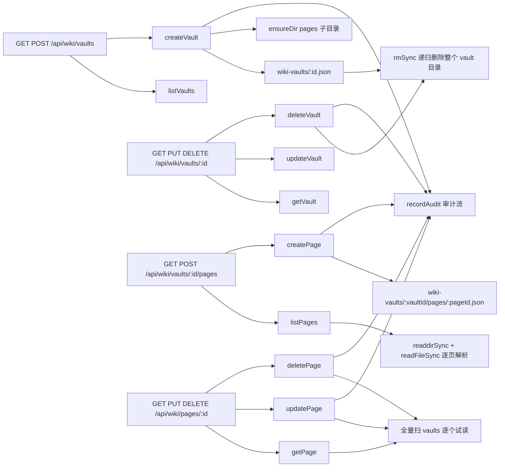

# wiki-service

> 深度：standard（分量分 0.519）

## 职责

`apps/web/lib/services/wiki-service.ts` 是知识库（Wiki Vault）与知识页（Wiki Page）的领域服务，8 个导出函数分两层：

1. **Vault 层**：listVaults / getVault / createVault / updateVault / deleteVault（[wiki-service.ts:7](apps/web/lib/services/wiki-service.ts#L7)、[wiki-service.ts:25](apps/web/lib/services/wiki-service.ts#L25)、[wiki-service.ts:29](apps/web/lib/services/wiki-service.ts#L29)、[wiki-service.ts:62](apps/web/lib/services/wiki-service.ts#L62)、[wiki-service.ts:72](apps/web/lib/services/wiki-service.ts#L72)）
2. **Page 层**：listPages / getPage / createPage / updatePage / deletePage（[wiki-service.ts:87](apps/web/lib/services/wiki-service.ts#L87)、[wiki-service.ts:133](apps/web/lib/services/wiki-service.ts#L133)、[wiki-service.ts:144](apps/web/lib/services/wiki-service.ts#L144)、[wiki-service.ts:194](apps/web/lib/services/wiki-service.ts#L194)、[wiki-service.ts:211](apps/web/lib/services/wiki-service.ts#L211)）

它与其他 service 最大的结构差异：page 不是独立顶层目录，而是以"每页一文件"嵌套存储在各自 vault 目录的 `pages/` 子目录下（[wiki-service.ts:186](apps/web/lib/services/wiki-service.ts#L186)）。消费方是 wiki 下四个路由文件（见依赖节反向表）。

## 设计原理

**Page 物理嵌套在 vault 目录下。** createVault 在建 vault 元数据的同时 ensureDir 出 `wiki-vaults/<id>/pages` 子目录（[wiki-service.ts:56-57](apps/web/lib/services/wiki-service.ts#L56-L57)）；createPage 把页面写进该嵌套路径（[wiki-service.ts:186](apps/web/lib/services/wiki-service.ts#L186)）。物理隔离随 vault 走，删除 vault 时整目录一起消失——代价是跨 vault 的 page 定位没有索引，见已知坑第 3 条。

**listPages 绕过 store 抽象，直接用 fs 原生 API。** 目录不存在返回空集（[wiki-service.ts:96-97](apps/web/lib/services/wiki-service.ts#L96-L97)）；否则 readdirSync 列文件、readFileSync 逐个读、JSON.parse 解析（[wiki-service.ts:99-108](apps/web/lib/services/wiki-service.ts#L99-L108)），过滤（lifecycle/tier 有 "ALL" 豁免 [wiki-service.ts:110-115](apps/web/lib/services/wiki-service.ts#L110-L115)，tag 与 search 无豁免 [wiki-service.ts:116-125](apps/web/lib/services/wiki-service.ts#L116-L125)）、排序（[wiki-service.ts:127](apps/web/lib/services/wiki-service.ts#L127)）、slice 分页（[wiki-service.ts:129](apps/web/lib/services/wiki-service.ts#L129)）全部手工完成。

**Vault 元数据走标准 store 通路。** listVaults 用 store.queryList（[wiki-service.ts:13-22](apps/web/lib/services/wiki-service.ts#L13-L22)，updatedAt 倒序 [wiki-service.ts:19](apps/web/lib/services/wiki-service.ts#L19)），getVault 直接 read（[wiki-service.ts:25-27](apps/web/lib/services/wiki-service.ts#L25-L27)）——同一 service 内两种存储访问风格并存。

**gitRepoUrl 空串规范化为 null。** createVault 用 `|| null` 而非 `?? null`（[wiki-service.ts:45](apps/web/lib/services/wiki-service.ts#L45)），与 schema 层允许空串的设计配合（[schemas.ts:155](apps/web/lib/schemas.ts#L155) 的 `.or(z.literal(""))`）——空值统一成一个形态。

**删除语义：vault 与 page 都是物理删除。** deleteVault 递归 rmSync 删目录后 store.delete 元数据（[wiki-service.ts:76-82](apps/web/lib/services/wiki-service.ts#L76-L82)）；deletePage 直接 store.delete 页面文件（[wiki-service.ts:216](apps/web/lib/services/wiki-service.ts#L216)）。这与 agent/skill 的"归档不删除"软删约定相反，只有审计记录可追溯。

## 关键决策

| # | 决策 | 动因与证据 |
|---|------|-----------|
| 1 | page 嵌套存储在 vault 子目录 | 物理隔离随 vault 走，整库可一键迁移/删除（[wiki-service.ts:57](apps/web/lib/services/wiki-service.ts#L57)、[wiki-service.ts:79-80](apps/web/lib/services/wiki-service.ts#L79-L80)）；代价见坑 3 |
| 2 | listPages 手工 fs 扫描 | 嵌套目录的读取在 service 内自足完成，不依赖 store 的列表能力（[wiki-service.ts:99-129](apps/web/lib/services/wiki-service.ts#L99-L129)） |
| 3 | 路由 path 的 vaultId 覆盖 body | pages 路由注释明确"path 的 id 为权威 vaultId"（[route.ts:26-27](apps/web/app/api/wiki/vaults/[id]/pages/route.ts#L26-L27)），与 release/review 路由同款约定 |
| 4 | gitRepoUrl 空串归一为 null | schema 允许空串（[schemas.ts:155](apps/web/lib/schemas.ts#L155)），service 用 `\|\| null` 收口（[wiki-service.ts:45](apps/web/lib/services/wiki-service.ts#L45)） |
| 5 | vault 统计字段一次性初始化 | pageCount/avgConfidence/orphanCount 建库时置 0（[wiki-service.ts:47-49](apps/web/lib/services/wiki-service.ts#L47-L49)），不做增量维护——代价见坑 2 |

## 依赖

import 全集五项（[wiki-service.ts:1-5](apps/web/lib/services/wiki-service.ts#L1-L5)）：store、fs 四函数（existsSync/readdirSync/rmSync/readFileSync）、join、NotFoundError、recordAudit。fs 直用是它区别于其他 service 的标志。

反向依赖（全部调用点）：

| 调用方 | 函数 | 锚点 |
|--------|------|------|
| app/api/wiki/vaults/route.ts | listVaults / createVault | [route.ts:13](apps/web/app/api/wiki/vaults/route.ts#L13)、[route.ts:23](apps/web/app/api/wiki/vaults/route.ts#L23) |
| app/api/wiki/vaults/[id]/route.ts | getVault / updateVault / deleteVault | [route.ts:9](apps/web/app/api/wiki/vaults/[id]/route.ts#L9)、[route.ts:21](apps/web/app/api/wiki/vaults/[id]/route.ts#L21)、[route.ts:32](apps/web/app/api/wiki/vaults/[id]/route.ts#L32) |
| app/api/wiki/vaults/[id]/pages/route.ts | listPages / createPage | [route.ts:15](apps/web/app/api/wiki/vaults/[id]/pages/route.ts#L15)、[route.ts:27](apps/web/app/api/wiki/vaults/[id]/pages/route.ts#L27) |
| app/api/wiki/pages/[id]/route.ts | getPage / updatePage / deletePage | [route.ts:9](apps/web/app/api/wiki/pages/[id]/route.ts#L9)、[route.ts:21](apps/web/app/api/wiki/pages/[id]/route.ts#L21)、[route.ts:32](apps/web/app/api/wiki/pages/[id]/route.ts#L32) |
| lib/__tests__/wiki-service.test.ts | createVault 等 | [wiki-service.test.ts:31](apps/web/lib/__tests__/wiki-service.test.ts#L31) |

数据面：写 `wiki-vaults/<id>.json`（vault 元数据）与 `wiki-vaults/<id>/pages/<pageId>.json`（页面）；deleteVault 额外做目录级 rmSync。字段校验依赖路由层四个 wiki schema。

## 暴露接口

| 函数 | 签名要点 | 行为摘要 |
|------|---------|---------|
| `listVaults({skip,take,agentId?,shared?})` | shared 是布尔（[wiki-service.ts:17](apps/web/lib/services/wiki-service.ts#L17)） | queryList 过滤+分页，updatedAt 倒序；注意路由层只传 true（坑 5） |
| `getVault(id)` | 不存在返回 undefined→null | 直接 read，无聚合 |
| `createVault(data)` | 已过 createWikiVaultSchema | 默认值兜底（gitBranch main、统计字段 0）+ 建 pages 目录 + `wiki.vault.create` 审计（[wiki-service.ts:58](apps/web/lib/services/wiki-service.ts#L58)） |
| `updateVault(id, data)` | 全量展开 | `{ ...vault, ...data }` 无白名单（[wiki-service.ts:66](apps/web/lib/services/wiki-service.ts#L66)，坑 7）+ `wiki.vault.update` 审计 |
| `deleteVault(id)` | **物理删除** | rmSync pages 目录与 vault 目录（[wiki-service.ts:76-80](apps/web/lib/services/wiki-service.ts#L76-L80)）→ 删元数据 → `wiki.vault.delete` 审计 → `{deleted:true}` |
| `listPages({vaultId,skip,take,lifecycle?,tier?,tag?,search?})` | tag 参数路由层未暴露（坑 6） | fs 手工扫描+过滤+分页；目录不存在返回空集（[wiki-service.ts:97](apps/web/lib/services/wiki-service.ts#L97)） |
| `getPage(id)` | 跨 vault 全量扫描定位（[wiki-service.ts:134-140](apps/web/lib/services/wiki-service.ts#L134-L140)） | 命中时附加 vault 快照（[wiki-service.ts:138](apps/web/lib/services/wiki-service.ts#L138)）；全不中返回 null |
| `createPage(data)` | vault 存在校验（[wiki-service.ts:158-159](apps/web/lib/services/wiki-service.ts#L158-L159)） | 默认值：provenance EXTRACTED、lifecycle DRAFT、tier SPECIALIZED、baseConfidence 0.5（[wiki-service.ts:170-173](apps/web/lib/services/wiki-service.ts#L170-L173)）；filePath 由 slug 推导（[wiki-service.ts:177](apps/web/lib/services/wiki-service.ts#L177)）；`wiki.page.create` 审计 |
| `updatePage(id, data)` | 先全量扫 vaults 定位（[wiki-service.ts:195-197](apps/web/lib/services/wiki-service.ts#L195-L197)） | 全量展开合并（[wiki-service.ts:199](apps/web/lib/services/wiki-service.ts#L199)）+ `wiki.page.update` 审计；定位失败抛 NotFoundError（[wiki-service.ts:208](apps/web/lib/services/wiki-service.ts#L208)） |
| `deletePage(id)` | 物理删除单个文件（[wiki-service.ts:216](apps/web/lib/services/wiki-service.ts#L216)） | `wiki.page.delete` 审计；不回写 vault 计数（坑 2） |

## 数据流

写路径三种形态并存：vault 元数据走 store 标准写；page 走嵌套路径 store 写；deleteVault 走 fs 直删。审计方面 vault 与 page 的增删改共 5 个动作全部接了 recordAudit。

## 排查指南

| 症状 | 先看哪里 |
|------|---------|
| 新建 vault 的页面数/平均置信度/孤立页一直显示 0 | 这三个字段只在建库时初始化（[wiki-service.ts:47-49](apps/web/lib/services/wiki-service.ts#L47-L49)），页面增删从不回写；前端读的是静态值（`app/(dashboard)/wiki/page.tsx`（L269、L275），路径含路由组括号无法写成标准引用），只有种子库数据非零（见坑 2） |
| GET /api/wiki/vaults?shared=false 不生效 | 路由只把字符串 "true" 映射为 true，其余一律 undefined（[route.ts:11](apps/web/app/api/wiki/vaults/route.ts#L11)），"只要私有库"的过滤无法表达（坑 5） |
| 页面列表按 tag 过滤没反应 | service 支持 tag 过滤（[wiki-service.ts:116-118](apps/web/lib/services/wiki-service.ts#L116-L118)），但唯一路由调用根本没解析 tag 参数（[route.ts:11-15](apps/web/app/api/wiki/vaults/[id]/pages/route.ts#L11-L15)）（坑 6） |
| 列表接口报 500 INTERNAL，错误信息带 pages/xxx.json 路径 | 某个页面 JSON 损坏，listPages 解析失败抛裸 Error（[wiki-service.ts:106](apps/web/lib/services/wiki-service.ts#L106)）；修复对应文件（坑 4） |
| 删除 vault 后数据目录整个消失 | deleteVault 是物理删除 rmSync（[wiki-service.ts:76-80](apps/web/lib/services/wiki-service.ts#L76-L80)），无软删无回收站；恢复只能靠备份或种子（坑 1） |
| 已知 page id 但接口慢/想直接找文件 | getPage/updatePage/deletePage 都是全量扫 vaults 试读（[wiki-service.ts:134-140](apps/web/lib/services/wiki-service.ts#L134-L140)）；文件物理位置在 `data/wiki-vaults/<vaultId>/pages/<pageId>.json`（坑 3） |
| 测试中设了自定义数据根后 deleteVault 删错位置 | deleteVault 硬编码 `process.cwd()/data`（[wiki-service.ts:76](apps/web/lib/services/wiki-service.ts#L76)、[wiki-service.ts:79](apps/web/lib/services/wiki-service.ts#L79)），不读 store 的 dataDirOverride（[store.ts:10-13](apps/web/lib/data/store.ts#L10-L13)）（坑 1） |

## 已知坑

1. **deleteVault 是物理删除，且硬编码数据根路径。** rmSync 递归删 pages 与 vault 目录（[wiki-service.ts:76-80](apps/web/lib/services/wiki-service.ts#L76-L80)），路径写死 `join(process.cwd(), "data", ...)`——绕过了 store 的数据根解析（store 尊重 dataDirOverride，[store.ts:10-13](apps/web/lib/data/store.ts#L10-L13)）。一旦部署或测试通过 store 的 override 机制改变数据根，deleteVault 仍去删默认 cwd 下的目录：轻则删空、重则误删。同时它与 agent/skill 的软删约定相反，误删不可恢复，只有一条审计记录可查。
2. **vault 统计字段是静态的，从不回写。** pageCount/avgConfidence/orphanCount 建库置 0（[wiki-service.ts:47-49](apps/web/lib/services/wiki-service.ts#L47-L49)）后，createPage/deletePage/updatePage 均不更新 vault 文件（对比 skill-service 的 bindSkill 会维护 `_count.skillBindings`，[skill-service.ts:162](apps/web/lib/services/skill-service.ts#L162)）；`_count.pages` 同样无人维护。运行时创建的 vault 这些字段恒 0，种子库（data/wiki-vaults/*.json）里的值是静态快照；前端展示的"平均置信度/孤立页"读的是陈旧数据。
3. **跨 vault 定位 page 靠全量扫描，page.vaultId 字段未被利用。** getPage/updatePage/deletePage 都先 list 全部 vaults 再逐个试读 pages 目录（[wiki-service.ts:134-140](apps/web/lib/services/wiki-service.ts#L134-L140)、[wiki-service.ts:195-197](apps/web/lib/services/wiki-service.ts#L195-L197)、[wiki-service.ts:213-215](apps/web/lib/services/wiki-service.ts#L213-L215)）——page 记录里明明有 vaultId 字段（[wiki-service.ts:165](apps/web/lib/services/wiki-service.ts#L165)），但删除/更新时入参只有 id，没有"先读 page 拿 vaultId 再直达"的索引路径。vault 数量线性增长时这三个接口线性变慢。
4. **listPages 抛裸 Error，绕过 AppError 体系。** JSON.parse 失败时 `throw new Error(...)`（[wiki-service.ts:106](apps/web/lib/services/wiki-service.ts#L106)），而全链路错误映射只认 AppError（[errors.ts:72-82](apps/web/lib/errors.ts#L72-L82)），裸错误走兜底分支归为 500 INTERNAL 且 message 原样透出（[errors.test.ts:63-67](apps/web/lib/__tests__/errors.test.ts#L63-L67)）——无法结构化区分"数据损坏"与其他内部错误（对比 store.readArray 的结构化抛错，[store.ts:131-138](apps/web/lib/data/store.ts#L131-L138)）。
5. **shared=false 过滤不可达。** service 层写法支持布尔值（`params.shared !== undefined`，[wiki-service.ts:17](apps/web/lib/services/wiki-service.ts#L17)），但路由只把 `"true"` 映射为 true、其余全部变 undefined（[route.ts:11](apps/web/app/api/wiki/vaults/route.ts#L11)）——"只看私有库"的查询无法通过 API 表达，isShared=false 的 vault 只能全量拉回后客户端自己筛。
6. **listPages 的 tag 过滤是 service 层死参数。** 函数签名有 tag（[wiki-service.ts:116-118](apps/web/lib/services/wiki-service.ts#L116-L118)），但唯一生产调用方 pages 路由只解析 lifecycle/tier/search 三个参数（[route.ts:11-15](apps/web/app/api/wiki/vaults/[id]/pages/route.ts#L11-L15)）——与 feedback-service 的 tag 过滤（路由有暴露、缺 "ALL" 豁免，见 [feedback-service.md](feedback-service.md) 已知坑 3）正好构成一对相反的缺陷。
7. **updateVault/updatePage 全量展开，防线全在路由 schema。** `{ ...vault, ...data }`（[wiki-service.ts:66](apps/web/lib/services/wiki-service.ts#L66)）与 `{ ...page, ...data }`（[wiki-service.ts:199](apps/web/lib/services/wiki-service.ts#L199)）都不做字段白名单，与 updateSkill 同款问题（见 [skill-service.md](skill-service.md) 已知坑 3）：当前安全依赖唯一调用方传 schema 校验后的数据，直调 service 的新代码可覆盖 id、createdAt 等任意字段。
