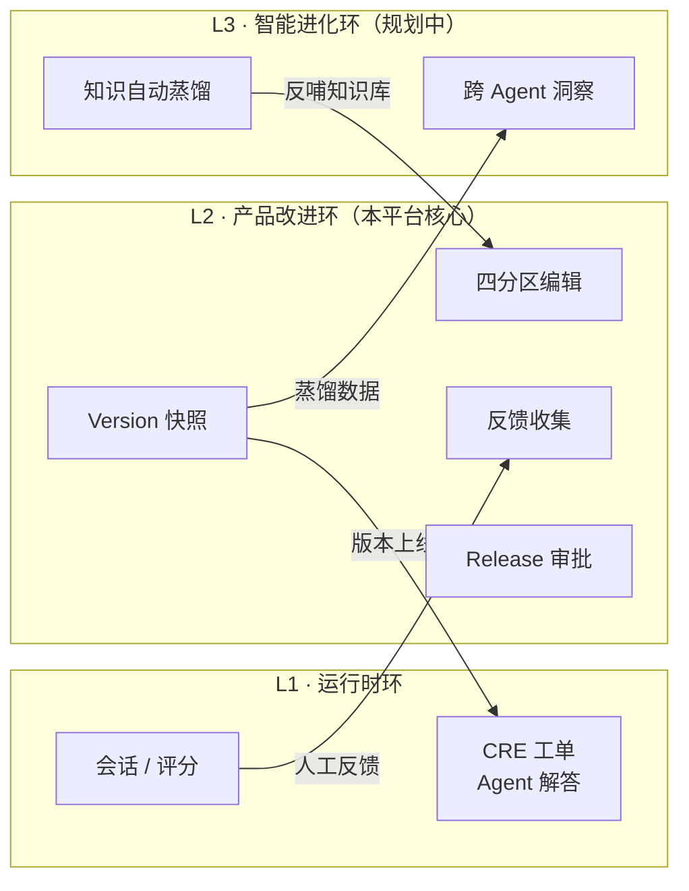
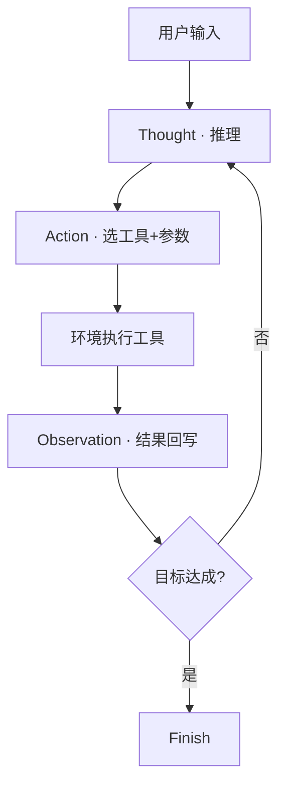
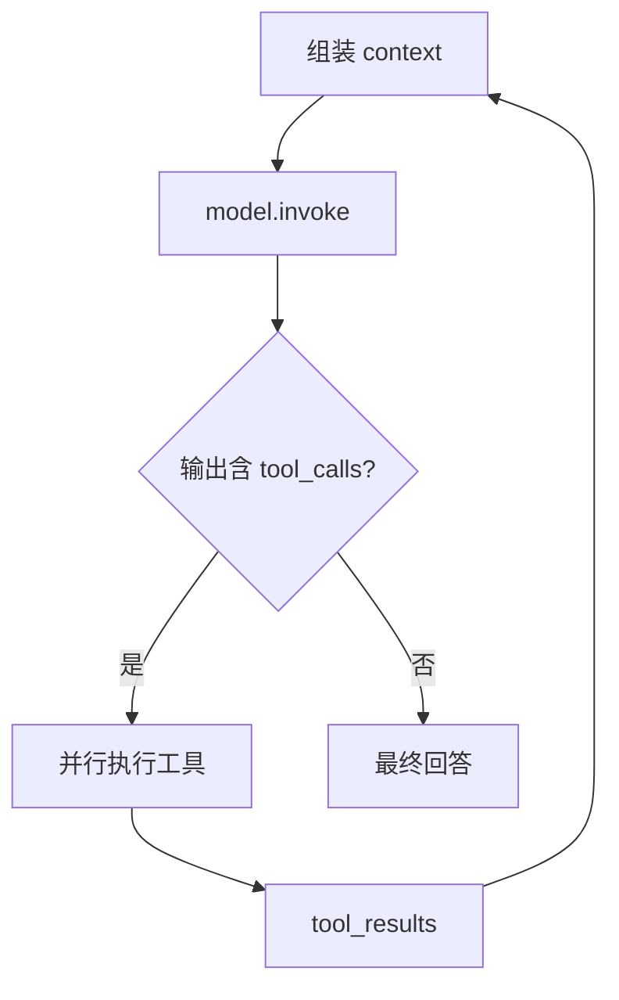
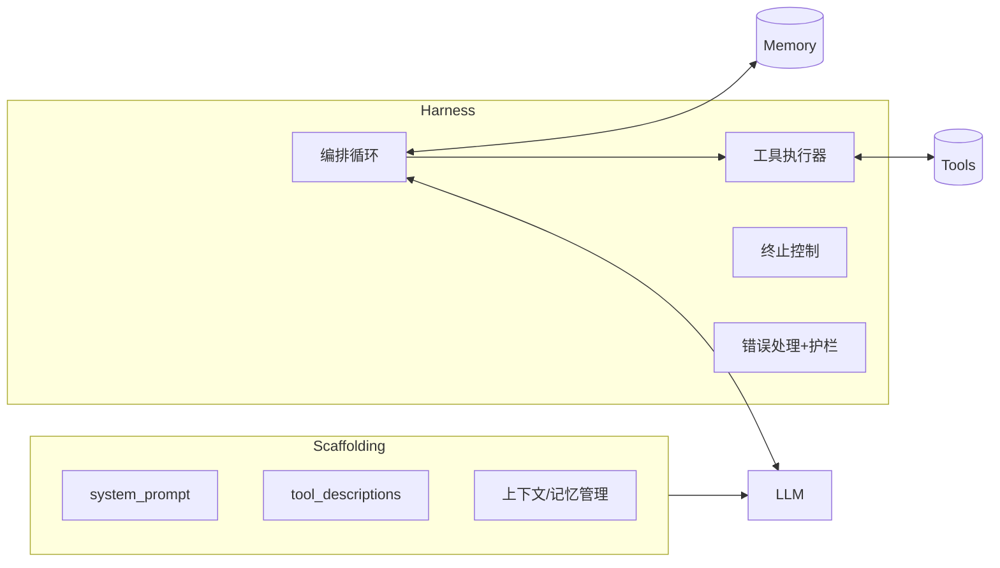
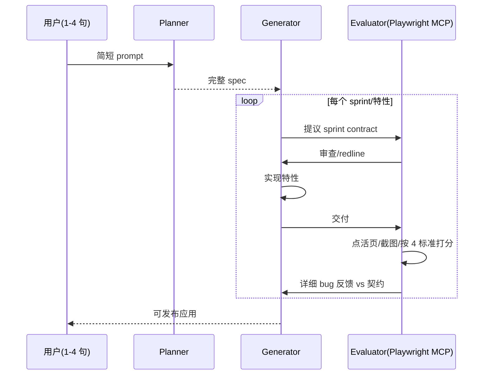
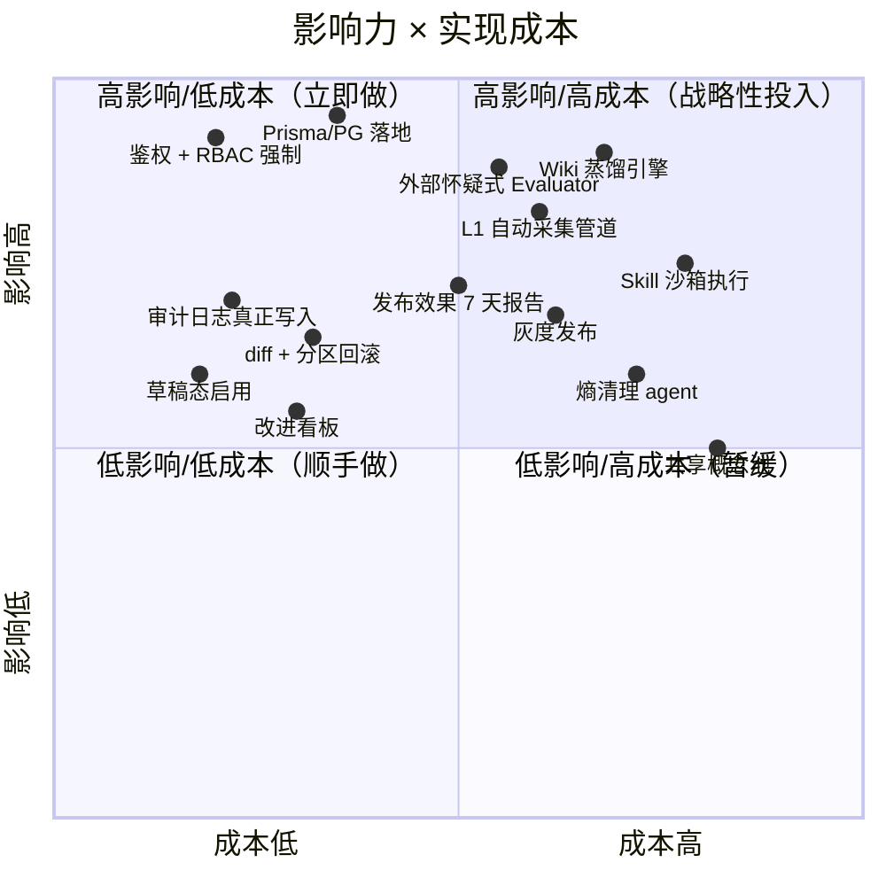

# AgentUp 项目评估 + Harness / Loop 工程参考

> 状态：**历史快照**（2026-07-21 时点评估，文中统计数字与缺口结论可能已过时）；最新状态见 [2026-07-31 差距分析](../reports/2026-07-31-project-evaluation-and-industry-gap-analysis.md) 与 [2026-08-25 LLM 交付报告](../reports/2026-08-25-mimo-llm-integration-delivery.md)
> 日期：2026-07-21
> 范围：对 `agent-up`（Agent 改进平台）的整体评估（功能完整性 + 创意性），并以 web 页面（`/architecture`、`/architecture/loop`、`/architecture/harness`、`/architecture/roadmap`）全面参考业界 **Harness 工程** 与 **Loop 工程**，用 mermaid 图 + 表格清晰呈现。
> 本文档是上述 web 页面内容的 markdown 版（单一真相源），便于 PR review。

---

## 一、项目定位

**AgentUp（Agent 改进平台）** 是面向私有云工单团队的「Agent 持续改进管理平台」。每个产品线（ECS / RDS …）有一个 on-duty Agent，CRE（Customer Reliability Engineer）使用它解决客户工单；产品组基于反馈不断改进 Agent（Prompt / 知识 / 工具 / 路由），并通过审批流上线。Agent 是集中部署的「值班顾问」，不直接操作客户的私有云。

- **首发范围**：子项目 B（产品组改进工作台）+ D（统一 Web UI）。反馈**手动录入**。A（L1 采集）/ C（L3 进化）延后。
- **技术栈**：Next.js 16 (App Router) · TypeScript 5 · Turborepo · Tailwind v4 · Prisma 6（schema 就绪但未接）· Zod · Vitest。
- **设计骨架**：三层 Loop（L1/L2/L3）× 四分区 Agent 配置（Prompt / 知识 / 工具 / 路由）。
- **MVP 角色**：工单团队（admin）/ 产品组 / CRE（只读）。扩展设计含 7 角色。

---

## 二、三层 Loop · 数据流全景

本平台的设计核心是「时间尺度不同的三层 Loop」：

- **L1 · 运行时环（分钟级）**：Agent 实时解答工单。**不在此平台构建**，平台只消费它的产物。
- **L2 · 产品改进环（小时~天）**：本平台核心。反馈 → 根因 → 改分区 → Release → 审批 → Version 快照 → 回滚。
- **L3 · 智能进化环（周~月）**：跨 Agent 洞察 + 自动蒸馏 + 共享概念池。规划中。

---

## 三、功能完整性 · 八维评分

| 维度 | 评分 | 现状 | 关键缺口 |
|---|---|---|---|
| Agent 配置（四分区） | ★★★★★ | Prompt/知识/工具/路由 四分区编辑器全部实现；分区级 version 已有 | 草稿态（AgentDraftConfig）未真正启用，直接写 active |
| 发布流（Release→Version） | ★★★★ | 提交→审批→通过后生成不可变 Version 快照（语义化版本） | 无 diff 查看器、无分区级回滚、无灰度 |
| Skills 体系 | ★★★ | Skill 注册表 + Agent 绑定/解绑 + 类别/运行时模型齐全 | 无沙箱执行、无市场、MCP/Workflow 仅建模 |
| Wiki 知识库 | ★★★ | llm-wiki 蒸馏知识网络模式：vault→page，含 provenance/lifecycle/tier | **蒸馏引擎未实现**；无 Git 版本化；无共享概念池 |
| 反馈闭环 | ★★★ | 反馈 CRUD、根因分析字段、与 Release 关联齐全 | **L1 自动采集管道缺失（手动录入）** |
| RBAC / 审计 | ★★ | 数据模型完整（Role/Permission/UserRole/AuditLog） | **无真鉴权（login 是 stub）；RBAC 未强制；审计未真写** |
| 数据持久化 | ★★ | Prisma schema 626 行、30 个模型已就绪 | **运行时用 JSON 文件，Prisma 完全没接；无迁移** |
| 可观测性 / 效果度量 | ★ | 仅 dashboard 聚合统计 + 审计日志数据 | **无发布后 7 天效果报告、无改进看板、无指标埋点** |

---

## 四、创意性评估

| 设计点 | 创意度 | 对比同类（LangGraph / Dify / Cursor Agent 配置） |
|---|---|---|
| **四分区 Agent 配置面板** | 高 | 多数平台把这几项散落不同页；「一个 Agent = 一张配置卡」对非开发者（产品组、工单团队）认知负担最低 |
| **两层知识架构**（Wiki 蒸馏优先，MCP 兜底） | 高 | "Compile, don't retrieve" —— 先查高质量蒸馏知识，再回退实时 MCP。WIKI_FIRST / HYBRID 等策略可配 |
| **三层 Loop 时间尺度** | 高 | 把「运行 loop」与「改进 loop」明确分层耦合，是这个垂直场景里少见的清晰框架 |
| **Release → 不可变 Version 快照** | 中高 | 借鉴 Git/CI 做 Agent 配置版本化 + 一键回滚 |
| **反馈 → 知识蒸馏入口** | 中（设计中） | 一条反馈喂 wiki-ingest 产出草稿页 —— L3 轻量入口 |
| **Sandbox 技能执行** | 低（未做） | Skills 仅有元数据，无安全执行环境 —— 相对 smolagents / Codex 明显短板 |

**一句话结论**：**设计成熟度高于实现成熟度**。文档里的架构判断（三层 Loop、四分区、两层知识）有创意且贴场景；但「设计已就绪、运行时未接通」的债务（Prisma 未用、鉴权 stub、审计未写、蒸馏引擎缺位）补齐，才是从 MVP 走向可上线的第一要务。

---

## 五、Loop 工程设计核心（业界参考）

「Loop」在 AI Agent 语境下指推理-行动-观察循环。每个严肃 Agent 都收敛到同一骨架：`while 未完成 → 推理 → 行动 → 观察`。

### 5.1 ReAct（Yao et al. 2022）— 一切的源头

| 阶段 | 职责 | 关键设计 |
|---|---|---|
| Thought | 产出推理轨迹 | 必须显式化 —— 可解释性 + self-reflection 的基础 |
| Action | 选工具 + 参数 | 动作空间可枚举；Manus 用 logit masking 动态收窄 |
| Observation | 环境返回结果回写 | 失败也作为 observation 直送，不要包装重试 |
| Finish | 判定目标达成 | ReAct 用 Finish[]；后续加 max-iter / 预算 / 超时 |

### 5.2 Anthropic 最小范式（while + tools）

论点：Agent = LLM 在 while 循环里 + 工具。反对过度工程化。

**7 种终止条件**：模型自然停 / max_turns / **预算-token** / 时间预算 / **循环检测** / **上下文窗口触顶（触发 compaction 或交接 subagent）** / 人工中断。

### 5.3 Manus · 上下文工程五个反直觉决策

平均任务 ≈50 次工具调用，input:output ≈ 100:1，所以上下文工程 = 成本工程 = 质量工程。

| 决策 | 反直觉之处 | 对 AgentUp 的启发 |
|---|---|---|
| **KV-cache 命中率是 #1 指标** | 缓存 $0.30 vs 未缓存 $3.00 / MTok —— 10x | L1 Agent 的 system_prompt 固定前缀；wiki 检索结果追加在末尾 |
| **Mask 工具而非增删** | 动态加减工具会让 cache 失效 + 历史失配 | 「工具」分区按工单类型收窄应走 logit mask |
| **文件系统即上下文** | 128K 不够；可恢复内容落文件只留引用 | Wiki vault 正是此思路 —— 蒸馏页 + provenance |
| **todo.md 复述** | 重写计划追加到 context 末尾，借近因偏置维持聚焦 | 路由分区可输出结构化任务清单喂给 L1 |
| **保留失败** | 失败 + 错误栈留在上下文，模型隐式纠偏 | CRE 的失败案例是高价值训练信号，别只存成功路径 |

### 5.4 OpenAI Swarm → Agents SDK

Swarm 自称「一个简单 Python loop」。Agents SDK 把它演进成 Runner 循环 + 四原语（Agent / Tool / **Handoff** / Guardrail）+ Tracing。关键创新：**Handoff 作为一等公民** —— 同一个 loop 既驱动单 Agent，也驱动多 Agent。

### 5.5 AgentUp 三层 Loop 与业界对齐

| 层 | 时间尺度 | 对应业界 loop | 本平台做什么 |
|---|---|---|---|
| **L1 运行时环** | 分钟 | ReAct / Anthropic while+tools / Manus / Swarm Runner | **不在此构建**，只消费产物 |
| **L2 产品改进环** | 小时~天 | Anthropic「人工中断门」+ OpenAI「Repo 即真相源 + 机械约束」 | **本平台核心**：四分区→Release→审批→Version→回滚 |
| **L3 智能进化环** | 周~月 | Anthropic「外部怀疑式评估」+ Manus「文件系统即上下文」蒸馏 | 规划中：跨 Agent 洞察 + 自动蒸馏 + 共享概念池 |

**关键对齐判断**：业界 Loop 经验几乎都属于 L1（运行时），而 AgentUp 本身是 **L2/L3 的「改进 harness」**。所以借鉴的不是「怎么把 Agent loop 写好」，而是**怎么把业界 harness 的工程纪律应用到「Agent 配置的迭代」上**。

### 5.6 横向对比：六种 loop 实现

| 系统 | loop 原语 | 多 Agent | 终止 | 亮点 |
|---|---|---|---|---|
| ReAct | Thought→Action→Observation | 否 | Finish[]/max-iter | 奠基范式 |
| Anthropic 最小 | while + tools | subagent fan-out | 7 种 | 反对过度工程 |
| OpenAI Agents SDK | Runner loop | **handoff 一等公民** | max_turns/final | 单 loop 即多 Agent |
| Manus | VM 内 loop | minimal | todo 完成/预算 | **上下文工程最深** |
| Claude Research | 嵌套 orchestrator-worker | **fan-out 3-5+** | 信息充分 | 比单 Agent +90.2% |
| LangGraph | cyclic StateGraph | map-reduce | END/递归限 | **可检查点/可恢复** |

---

## 六、Harness 工程设计核心（业界参考）

**Harness** 是包裹 LLM 的执行层 —— 调用模型、处理工具调用、决定何时停止。HF 术语：`Agent = Model + Harness`。

### 6.1 术语：Scaffold vs Harness

- **Scaffolding（行为定义层）**：system prompt、tool descriptions、响应解析、上下文/记忆管理。决定模型**怎么看待世界**。
- **Harness（执行层）**：调用模型、处理工具调用、决定何时停。决定**怎么跑**。
- **AgentUp 的四分区配置改的是 scaffold；Release 审批 + Version 快照管的是 harness 的版本。**

### 6.2 Harness 五大子系统（业界共识）

| # | 子系统 | 职责 | 常见失败/改进点 |
|---|---|---|---|
| 1 | **编排循环**（心跳） | observe→think→act→observe | 只查「模型停没停」而非「目标达没达」 |
| 2 | **工具**（Agent 的手） | 执行有副作用动作 | 参数校验 / 沙箱 |
| 3 | **记忆** | 短期 in-context + 长期 external | 主动管理「什么留上下文」 |
| 4 | **上下文/状态** | 模型每步看到什么 | 渐进披露 —— 给地图不给 1000 页手册 |
| 5 | **验证/护栏** | 权限、错误处理、停止条件 | linters-as-feedback、循环检测 |

**Oracle 的 agent loop 三层（最重要 meta-insight）**：L1 单次 prompt→response；L2 工具执行循环；**L3 目标完成循环** —— harness 主动检查「目标真达成了吗」而非「模型停了吗」。绝大多数被低估的缺口都在 L3。

### 6.3 OpenAI Harness Engineering 七大决策（百万行 Codex 案例）

5 个月、3→7 名工程师，Codex 写约 100 万行、合并约 1500 PR，**0 行手写**。论断：**"Humans steer. Agents execute."**

| # | 决策 | 核心理念 | 对 AgentUp 的启发 |
|---|---|---|---|
| 1 | **Repo 即真相源 + 渐进披露** | AGENTS.md ≈100 行做目录，深度知识放 docs/ | 四分区 Prompt 避免堆砌，详细约束沉淀到 Wiki |
| 2 | **机械约束架构** | 业务域刚性分层 + linters；lint 错误信息即 remediation | Agent 配置加 schema 校验 + 可读拒绝理由（已有 Zod） |
| 3 | **让应用对 Agent 可读** | 每 worktree 可启动；CDP/可观测接进 runtime | CRE 反馈应自带可复现会话/证据 |
| 4 | **Ralph Wiggum 反馈环** | 本地自审→云端 agent 审→迭代至 reviewer 满意 | **L3 Evaluator 雏形** —— Release 审批前加 agent 自审+互审 |
| 5 | **最小阻塞门禁** | corrections cheap, waiting expensive | 高频小改走 fast-track（灰度+自动回滚） |
| 6 | **熵清理 / garbage collection** | golden principles + 后台 agent 扫偏离 + 自动 refactor PR | **L3 关键能力** —— 定期扫所有 Agent 配置发现漂移 |
| 7 | **全自主阈值** | 单 prompt → 复现→修→验→PR→反馈→合并 | 远期：反馈→自动定位分区→起草改动→灰度上线 |

### 6.4 Anthropic · Planner → Generator ↔ Evaluator 三体设计

受 GAN 启发。解决两个问题：(a) 长跑上下文一致性；(b) 模型自我评估偏宽。

- **Planner**：1-4 句扩成完整 spec，雄心范围，仅高层技术。
- **Generator**：一次建一特性，与 Evaluator 通过**文件**协商 sprint contract。
- **Evaluator**：Playwright MCP 点活页面 + 截图 + 打分，调到「怀疑」而非默认；4 标准（设计质量/原创性/工艺/功能）前两个权重最高。
- **数据**：solo agent 20 分钟 $9「看起来对但坏了」；完整 harness 6 小时 $200（20× 成本）出可发布精品。
- **Meta-lesson**：**harness 里每个组件都编码了一条「模型独自做不到」的假设 —— 去压力测试，它们会随模型升级而过时。**

### 6.5 Harness 哲学 · 三方对比

| 维度 | OpenAI（Codex） | Anthropic（三体） | HF smolagents |
|---|---|---|---|
| 主单元 | Repo + 环境 | Generator↔Evaluator 对 | Agent 类（Code/ToolCalling） |
| 分解 | 业务域分层 + linters | Planner→Generator→Evaluator | managed agent 层级 |
| 记忆 | Repo 即真相源 | context reset/compaction + 文件交接 | in-context logs |
| 验证 | 自定义 linters + 结构测试 + agent reviewers | **怀疑式 Evaluator + Playwright** | final_answer_checks |
| 创新论点 | **对 Agent 可读 > 人类风格** | **GAN 式生成/评估分离** | **代码即动作 > JSON 即动作** |

### 6.6 映射到 AgentUp

| Harness 子系统 | AgentUp 对应物 | 成熟度 | 改进方向 |
|---|---|---|---|
| **编排循环** | L2：反馈→根因→编辑→Release→审批→Version→回滚 | 较成熟 | 加 fast-track；加目标完成校验 |
| **工具执行** | Skills（HTTP/Function/MCP/Workflow）+ Wiki 查询 + 两层知识 | 中等 | **沙箱执行缺失**；MCP/Workflow 仅建模 |
| **记忆** | Wiki Vault（蒸馏知识网络） | 中等 | **蒸馏引擎未实现**（L3 入口） |
| **上下文/状态** | 四分区配置 + 分区 version + 草稿态 | 设计成熟 | 草稿态未真正启用 |
| **验证/护栏** | Release 审批 + 审计日志（未真写）+ RBAC（未强制） | **薄弱** | **鉴权 stub、RBAC 未强制、审计未写**；加外部怀疑式 Evaluator |

**最关键的一句对齐**：OpenAI「**人类转向，Agent 执行；工程师变成环境/反馈环设计者**」的核心论断，**恰好是 AgentUp 想给「产品组」提供的能力** —— 让非开发者也能像 harness 工程师一样迭代 Agent。**AgentUp 的产品价值 = 把 harness 工程纪律产品化给业务团队。**

---

## 七、改进路线图

### 7.1 优先级矩阵（影响力 × 成本）

### 7.2 P0 · 可上线基线（~2-3 周）

| 改进项 | 来源 | 落点 | 收益 |
|---|---|---|---|
| **鉴权 + RBAC 强制** | 通用 | NextAuth 5 + 中间件 + API ACL | 最小权限；审计有主体 |
| **Prisma/Postgres 落地** | 通用 | 接通 626 行 schema + 首个迁移 | 多实例/并发/审计基础 |
| **审计日志真正写入** | 通用 | 每个写操作后 append AuditLog | 合规 + 事故溯源 |
| **草稿态启用** | OpenAI ⑦ | 四分区编辑写 draft；Release 提升 draft→active | 改一半不污染线上 |

### 7.3 P1 · Harness 纪律（最有创意性，~3-4 周）

| 改进项 | 来源 | 落点 | 收益 |
|---|---|---|---|
| **外部怀疑式 Evaluator** | Anthropic Generator/Evaluator | Release 提交后、人工审批前加 agent 自审+互审 | **最大质量杠杆**；Ralph Wiggum loop 落地 |
| **目标完成校验** | Oracle L3 | Release 通过 = 人工 approve + 通过一组可测行为 | 防止「模型停了≠目标达了」 |
| **diff 查看器 + 分区回滚** | OpenAI ① | 复用 lib/diff.ts + Version 分区级回滚 | 改能看清、错能回退 |
| **发布效果 7 天报告** | 通用 | 定时对比发布前后 7 天反馈率/严重度/解决率 | 改进 loop 的 observation |
| **灰度发布（Canary）** | OpenAI ⑤ | 复用 CanaryRelease/CanaryStage + 异常自动回滚 | corrections cheap, waiting expensive |

### 7.4 P2 · L3 智能化（~4-6 周）

| 改进项 | 来源 | 落点 | 收益 |
|---|---|---|---|
| **Wiki 蒸馏引擎** | Manus ③ + llm-wiki | WikiIngestJob 接 LLM → 草稿 wiki 页（带 provenance） | 两层知识架构核心一半 |
| **L1 反馈自动采集** | 通用 loop | L1 会话结束自动抽取（问题/路径/评分）入反馈表 | 改进 loop 输入不靠手填 |
| **熵清理 agent** | OpenAI ⑥ | 定期扫所有 Agent 配置发现漂移，开建议 PR | 防配置漂移 |
| **Skill 沙箱执行** | smolagents/Codex | Function/MCP 运行时接 E2B/Docker + import 白名单 | 「工具」分区真正可执行 |
| **改进看板（Kanban）** | 通用 | 反馈→根因→Release 串成看板 | L2 进行中工作可视化 |

### 7.5 P3 · 规模化（季度级）

共享概念池（跨 vault）/ 多租户隔离 / 开放 API + Webhook / Skill 市场。

---

## 八、总结 · 三条主线

1. **主线 1 · 工程债**：P0 全部是工程债（鉴权 / Prisma / 审计 / 草稿态）。「设计成熟度高于实现成熟度」的代价。补齐才能上线。
2. **主线 2 · Harness 产品化**：P1 是创意性最高的档（外部 Evaluator、目标完成校验、灰度）—— 把 OpenAI/Anthropic 的 harness 纪律产品化给业务团队。**这是 AgentUp 的真正差异化。**
3. **主线 3 · L3 兑现**：P2 兑现三层 Loop 的 L3（Wiki 蒸馏 + L1 采集 + 熵清理）—— 从「改进工具」升级为「自进化系统」，完整闭合 L1↔L2↔L3 数据流。

**一句话定位**：AgentUp 的产品价值，本质是 **「把 Harness 工程纪律，产品化给业务团队」** —— 让非开发者也能像 OpenAI/Anthropic 的 harness 工程师一样，用受控 loop + 外部评估 + 版本化 + 可观测，去持续改进 Agent。当前 MVP 已把「产品形」做对（四分区 + Release + Version + 三层 Loop 概念），下一步是把「harness 纪律」真正填进去。

---

## 附：web 页面索引

| 路由 | 内容 |
|---|---|
| `/architecture` | 架构总览 + 项目评估（功能完整性八维评分 + 创意性评估 + 关键缺口 Top 5） |
| `/architecture/loop` | Loop 工程（ReAct / Anthropic while+tools / Manus 五决策 / OpenAI Swarm + AgentUp 三层 Loop 对齐 + 六实现横向对比） |
| `/architecture/harness` | Harness 工程（术语 + 五子系统 + OpenAI 七决策 + Anthropic 三体 + 三方哲学 + AgentUp 映射） |
| `/architecture/roadmap` | 改进路线图（优先级矩阵 + P0/P1/P2/P3 + 三条主线总结） |

## 附：主要参考来源

- OpenAI — *Harness engineering: leveraging Codex in an agent-first world* — https://openai.com/index/harness-engineering/
- Anthropic — *Harness design for long-running application development* — https://www.anthropic.com/engineering/harness-design-long-running-apps
- Anthropic — *Building Effective Agents* — https://www.anthropic.com/engineering/building-effective-agents
- Anthropic — *How we built our multi-agent research system* — https://www.anthropic.com/engineering/multi-agent-research-system
- Hugging Face — *Agent Glossary (Scaffold vs Harness)* — https://huggingface.co/blog/agent-glossary
- Hugging Face — *smolagents Guided Tour* — https://huggingface.co/docs/smolagents/guided_tour
- Manus — *Context Engineering for AI Agents* — https://manus.im/blog/Context-Engineering-for-AI-Agents-Lessons-from-Building-Manus
- Yao et al. 2022 — *ReAct* — https://arxiv.org/abs/2210.03629
- OpenAI — *Agents SDK / swarm* — https://github.com/openai/swarm
