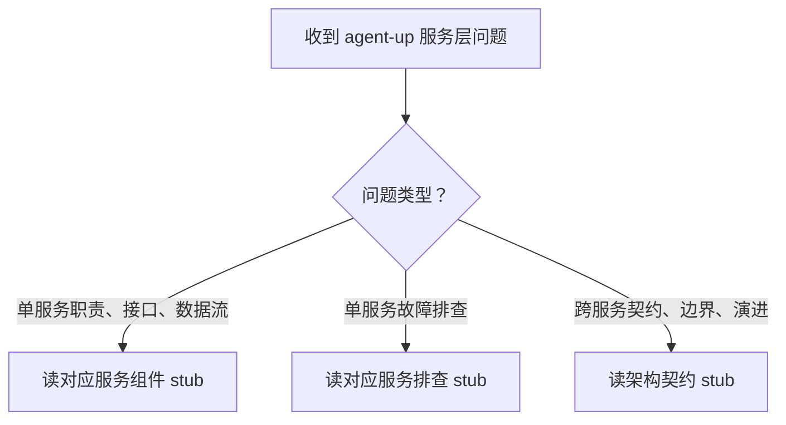

# skills-up 技能计划（硬门禁标的）

- 生成时间：2026-09-03
- 文档源：`docs/distilled/` 10 篇（`source_commit: 7524808330e38b5510c65b690348f59c127559c2`，10 篇一致）
- 计划落点：本文件与 `_plan.yaml` 落在 `docs/skills/`（简报裁定；gate 的覆盖检查实际读的是 `docs/distilled/_plan.yaml`，见文末「已知偏差」）

## 1. 技能数：1 个

**agent-up-services** —— 覆盖 agent-up 服务层全域。

**为什么是 1 个而不是 9 个（每服务一个）或 3 个（按场景聚类）：**

- 10 篇文档共享同一平台语境（apps/server services），拆成 9 个技能会把跨服务契约（AppError 体系、actor 传递、审计写入约定、store 统一存储）变成无家可归的孤儿内容；
- 触发词若按服务拆 9 个技能，`agent-service`、`audit-service` 这类裸词与用户日常表述的匹配会碎片化，且互相抢触发；
- 场景聚类（如「排查类技能 + 阅读类技能」）的边界任意性强，hub-stub-guide 的本体论原则支持按实体类型拆 stub 而不是按场景拆技能。

## 2. 触发词（frontmatter description 全文）

> Use when 需要理解、排查或修改 agent-up 平台服务层（apps/web 的 services 模块：agent-service、audit-service、effectiveness-service、feedback-service、llm-service、release-service、retrieval-service、skill-service、wiki-service）时使用，包括：回答某服务的职责边界、暴露接口、调用方式与设计决策；排查 agent 配置保存异常、审计记录缺失、反馈状态迁移被拒、发布版本派生与回滚异常、LLM 网关 503/502/504、检索评分不符预期、技能绑定不生效、wiki 页面误删等问题；分析服务间契约（AppError 体系、actor 从 context 传递、审计写入约定、store 统一存储）与发布主线数据流。不适用于：agent-up 前端页面（apps/web）的问题、非 agent-up 项目的通用 Node.js/Next.js 问题、通用 Skill 编写问题。

触发自查（人工复查第①道的素材）：

- **该触发**：
  1. 「agent-up 的 release-service 回滚之后版本号是怎么派生的？」
  2. 「为什么 agent 配置保存成功了，但列表里 versions 只显示 5 条？」
  3. 「audit 记录写入失败会让请求报错吗？」
- **不该触发**：
  1. 「帮我用 Next.js 15 写一个服务端组件」（通用前端，无服务层语境）
  2. 「改一下 agent-up 登录页的样式」（apps/web 前端，不在范围）
  3. 「把这份 Markdown 文档蒸馏成技能」（skills-up 的职责）

**冲突自查基线**：`~/.qoder/skills/` 实际 76 个目录，与简报 §6 清单逐项 diff 为空（简报标题写 75 是笔误，清单本身枚举 76 项，集合一致）。`agent-up-services` 不在其中，无重名；9 个服务名 + `architecture-contracts` 的组合命名在既有技能中无对应物。

## 3. hub 主流程草稿（SKILL.md 骨架）

```
1. 判断问题类型：单服务职责/接口/数据流 → 路由表第 1 组；单服务故障排查 → 路由表第 2 组；跨服务契约/边界/演进 → 架构契约 stub
2. 按路由表读对应 stub（每个 references/ 引用都带「当…时…读」时机）
3. 回答时只引用 stub 收录的关键决策与已知坑，不臆造 stub 未收录的源码细节
```

hub mermaid 草稿（路由图，中文 label 双引号、图内无 file:line）：



路由表（hub 正文核心，19 行，每行含 `references/…` 路径 + 「当…时…读」时机）：

| stub | 当…时…读 |
| --- | --- |
| `references/architecture-contracts.md` | 当需要回答服务间契约（AppError 体系、actor 从 context 传递、审计写入约定、store 统一存储）、服务边界或演进动因时读 |
| `references/agent-service-component.md` | 当需要了解 agent CRUD、配置双写留痕、软删除 ARCHIVED、withProductGroup 的职责与接口时读 |
| `references/agent-service-troubleshooting.md` | 当出现配置保存异常、versions 只显示 5 条、withProductGroup 逐行读文件慢时读 |
| `references/audit-service-component.md` | 当需要了解审计 fire-and-forget 写入语义、append-only 单文件、actor 快照时读 |
| `references/audit-service-troubleshooting.md` | 当出现审计记录缺失、审计文件全量重写、静默失败无告警时读 |
| `references/effectiveness-service-component.md` | 当需要了解效果报告 lazy fill、7 天窗口、computeEffectivenessReport 纯函数时读 |
| `references/effectiveness-service-troubleshooting.md` | 当出现效果报告为空、onDisk 悬空、GET 带写副作用时读 |
| `references/feedback-service-component.md` | 当需要了解反馈 8 状态状态机、ALLOWED_TRANSITIONS、状态驱动字段副作用时读 |
| `references/feedback-service-troubleshooting.md` | 当出现状态迁移被拒、assignedTo/verificationNote 静默丢失、tag 无 ALL 豁免时读 |
| `references/llm-service-component.md` | 当需要了解 MiMo 网关 chatCompletion、三档错误映射、env 凭据与 120s 超时时读 |
| `references/llm-service-troubleshooting.md` | 当出现 503/502/504、api-key 凭据缺失、请求超时时读 |
| `references/release-service-component.md` | 当需要了解发布提交/评审/回滚、diff 基线取最近已发布 Version、SemVer 规则时读 |
| `references/release-service-troubleshooting.md` | 当出现版本号派生异常、diff 基线不符预期、回滚行为不符预期时读 |
| `references/retrieval-service-component.md` | 当需要了解 BM25-lite 评分、CJK 单字+bigram、字段加权与 0.6/0.4 合成时读 |
| `references/retrieval-service-troubleshooting.md` | 当出现检索评分不符预期、CJK 查询召回差、生产零调用确认时读 |
| `references/skill-service-component.md` | 当需要了解技能绑定内嵌 agent 文件、幂等 upsert、软删除 ARCHIVED 时读 |
| `references/skill-service-troubleshooting.md` | 当出现技能绑定不生效、unbind 静默成功、publishedAt 脱节时读 |
| `references/wiki-service-component.md` | 当需要了解 Page 物理嵌套 vault/pages/、listPages 直读 fs、物理删除语义时读 |
| `references/wiki-service-troubleshooting.md` | 当出现页面被物理删除、listPages 抛裸 Error、跨 vault 扫描慢时读 |

红旗清单（hub 末尾，「想 <动作> → 停」句式）：

- 想把 fire-and-forget 审计改成同步阻塞 → 停（契约 stub：审计写入是设计决策）
- 想跨服务绕过 store 直接读写文件 → 停（契约 stub：存储统一走 store）
- 想回答 stub 未收录的源码细节 → 停（蒸馏边界，不臆造）
- 想省略排查四要素直接给修复建议 → 停（troubleshooting stub 纪律）

## 4. stub 拆分方案（按本体，19 个）

| # | stub 文件 | 本体实体 | source | 内容要点 |
| --- | --- | --- | --- | --- |
| 1 | `references/architecture-contracts.md` | data_flow + decision | services-overview.md | 服务层边界、四条模块间契约、发布主线数据流、演进动因 |
| 2 | `references/agent-service-component.md` | component | agent-service.md | 职责/设计原理/关键决策/暴露接口/数据流 |
| 3 | `references/agent-service-troubleshooting.md` | troubleshooting_path | agent-service.md | 四要素：问题现象/关键信息和关键报错/排查建议/解决建议 |
| 4 | `references/audit-service-component.md` | component | audit-service.md | 同 #2 结构 |
| 5 | `references/audit-service-troubleshooting.md` | troubleshooting_path | audit-service.md | 四要素 |
| 6 | `references/effectiveness-service-component.md` | component | effectiveness-service.md | 同 #2 结构 |
| 7 | `references/effectiveness-service-troubleshooting.md` | troubleshooting_path | effectiveness-service.md | 四要素 |
| 8 | `references/feedback-service-component.md` | component | feedback-service.md | 同 #2 结构 |
| 9 | `references/feedback-service-troubleshooting.md` | troubleshooting_path | feedback-service.md | 四要素 |
| 10 | `references/llm-service-component.md` | component | llm-service.md | 同 #2 结构 |
| 11 | `references/llm-service-troubleshooting.md` | troubleshooting_path | llm-service.md | 四要素 |
| 12 | `references/release-service-component.md` | component | release-service.md | 同 #2 结构 |
| 13 | `references/release-service-troubleshooting.md` | troubleshooting_path | release-service.md | 四要素 |
| 14 | `references/retrieval-service-component.md` | component | retrieval-service.md | 同 #2 结构 |
| 15 | `references/retrieval-service-troubleshooting.md` | troubleshooting_path | retrieval-service.md | 四要素 |
| 16 | `references/skill-service-component.md` | component | skill-service.md | 同 #2 结构 |
| 17 | `references/skill-service-troubleshooting.md` | troubleshooting_path | skill-service.md | 四要素 |
| 18 | `references/wiki-service-component.md` | component | wiki-service.md | 同 #2 结构 |
| 19 | `references/wiki-service-troubleshooting.md` | troubleshooting_path | wiki-service.md | 四要素 |

拆分纪律：

- 9 个 component stub 按 ontology component 实体组织（职责/设计原理/关键决策/暴露接口/数据流），不复制源文档的 mermaid（蒸馏而非搬运），排查内容一律不进 component stub，只放一行指向对应 troubleshooting stub 的路由（单一事实源）；
- 9 个 troubleshooting stub 严格四要素，缺要素的小节写「（源文档未覆盖）」；每篇含 1 个排查路径 mermaid（中文 label 双引号）；
- 全部 stub frontmatter：`title` + `source: docs/distilled/<name>.md` + `source_commit: 7524808330e38b5510c65b690348f59c127559c2`；
- 组件 stub 内禁止出现字面 `### 问题现象` 标题（gate 会据此把组件 stub 当排查类要求 mermaid）；
- 产物内零绝对路径、零占位符、代码块全部标语言、description 无模糊词。

## 5. 已知偏差（如实申报，随门禁报告进疑虑清单）

1. **gate 覆盖检查读不到本计划**：gate.py 的 `_load_plan` 只在 `source.doc_paths`（docs/distilled/）下找 `_plan.yaml`，那里已存在 code-up 的 `_plan.yaml`（覆盖全部 10 篇）。因此简报预期的 skipped「未找到 _plan.yaml」不会出现——覆盖检查将走「已覆盖」路径，结果是静默通过。本计划（docs/skills/_plan.yaml）对 gate 不可见，覆盖完整性由人工复查保证。
2. **简报技能数基线笔误**：简报标题写「75 个既有技能」，实际清单枚举 76 项，与本机 76 个目录一致（diff 为空）。
3. **诚实性检查空转**：10 篇文档均无「推测：」「浅度分析」标记（仅 code-up 的 _plan.md 提及格式规范，且该文件被 exclude 排除在源文档之外），`check_speculation_preserved` / `check_shallow_preserved` 将无内容可查——这是文档源的事实，不是漏查。
