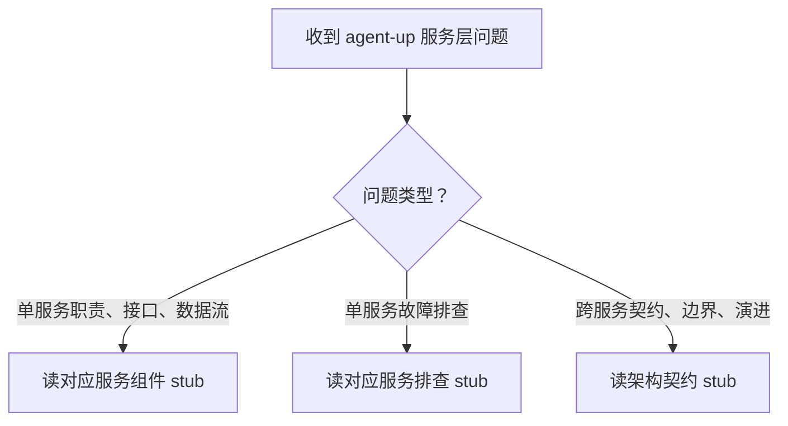

# agent-up-services

> agent-up 平台服务层（`apps/web/lib/services/`，9 个服务）的知识库：职责、接口、设计决策与排查路径。内容蒸馏自 `docs/distilled/` 的 10 篇架构文档（source_commit 见各 stub frontmatter），回答时只引用 stub 收录的内容，不臆造源码细节。

## 何时用

- 问题落在 agent-up 服务层：某个服务的职责、接口、调用方式、设计决策，或某服务引发的故障排查。
- 问题跨服务：契约（错误体系 / actor 传递 / 审计约定 / 存储约定）、发布主线数据流、模块边界与演进动因。
- 不适用：agent-up 前端 UI 交互问题、其他项目的通用 Node.js/Next.js 问题、如何编写 Skill。

## 主流程

1. 判断问题类型：单服务的职责 / 接口 / 数据流 → 路由表第 1 组组件 stub；单服务故障排查 → 路由表第 2 组排查 stub；跨服务契约 / 边界 / 演进 → 架构契约 stub。
2. 按路由表读对应 stub，每行都标注了「当…时…读」的加载时机；拿不准时先读架构契约 stub 建立全景。
3. 回答时只引用 stub 收录的关键决策与已知坑；排查类回答按「问题现象 / 关键信息和关键报错 / 排查建议 / 解决建议」四要素展开。

## stub 路由表

| stub | 当…时…读 |
| --- | --- |
| `references/architecture-contracts.md` | 当需要回答服务层边界、服务间契约（AppError 体系、actor 从 context 传递、审计写入约定、store 统一存储）、发布主线数据流或演进动因时读 |
| `references/agent-service-component.md` | 当需要了解 Agent CRUD、四分区配置读写、双写留痕、软删除 ARCHIVED、withProductGroup 的职责与接口时读 |
| `references/agent-service-troubleshooting.md` | 当出现配置保存异常、versions 只显示 5 条、列表产品组为空、配置留痕缺失时读 |
| `references/audit-service-component.md` | 当需要了解审计 fire-and-forget 语义、单文件 append-only、actor 快照、与 config-changes 的分工时读 |
| `references/audit-service-troubleshooting.md` | 当出现审计记录缺失、userName 与实际操作者对不上、按 userId 查不到记录、审计文件损坏时读 |
| `references/effectiveness-service-component.md` | 当需要了解效果报告 lazy fill、7 天窗口、computeEffectivenessReport 纯函数、幂等短路时读 |
| `references/effectiveness-service-troubleshooting.md` | 当出现效果标签不显示、报告数字不符预期、需要强制重算、审计出现「系统」署名的效果记录时读 |
| `references/feedback-service-component.md` | 当需要了解反馈 8 状态状态机、ALLOWED_TRANSITIONS、状态驱动字段副作用、withAgentName 时读 |
| `references/feedback-service-troubleshooting.md` | 当出现状态迁移被拒 422、assignedTo 或 verificationNote 静默丢失、tag 过滤传 ALL 返回空时读 |
| `references/llm-service-component.md` | 当需要了解 MiMo 网关 chatCompletion、三档错误 503/502/504、env 凭据、120 秒超时与 token 预算时读 |
| `references/llm-service-troubleshooting.md` | 当出现 LLM 未配置 503、上游错误 502、超时 504、模型返回空内容时读 |
| `references/release-service-component.md` | 当需要了解发布提交 / 审批 / 整版本回滚、diff 基线取最近已发布 Version、SemVer 升版规则时读 |
| `references/release-service-troubleshooting.md` | 当出现无变更提交被拒 422、重复审批 409、版本号与预期不符、回滚行为不符预期时读 |
| `references/retrieval-service-component.md` | 当需要了解 BM25-lite 评分、CJK 单字加 bigram 分词、字段加权与 0.6/0.4 合成时读 |
| `references/retrieval-service-troubleshooting.md` | 当出现检索评分不符预期、页面检索不出来、检索慢、需确认该服务生产零调用时读 |
| `references/skill-service-component.md` | 当需要了解技能绑定内嵌 agent 文件、幂等 upsert、软删除 ARCHIVED、作者快照时读 |
| `references/skill-service-troubleshooting.md` | 当出现技能绑定不生效、unbind 静默成功、publishedAt 恒为空、绑定审计署名为系统时读 |
| `references/wiki-service-component.md` | 当需要了解 Page 物理嵌套 vault 目录、listPages 直读 fs、物理删除语义、统计字段静态时读 |
| `references/wiki-service-troubleshooting.md` | 当出现页面误删、listPages 报 500、跨 vault 定位慢、shared=false 过滤不生效时读 |

## 红旗清单

- 想把 fire-and-forget 审计改成同步阻塞 → 停：审计写入失败不回滚业务是 audit-service 的设计决策，见架构契约 stub 的契约 3。
- 想跨服务绕过 store 直接读写数据文件 → 停：存储统一走 store 是全层契约；wiki 与 retrieval 有两处既存例外（各有记录），新代码不得新增例外。
- 想回答 stub 未收录的源码细节 → 停：本技能只蒸馏了 `docs/distilled/` 的内容，超出部分应回到源码核实，不要凭印象作答。
- 想省略排查四要素直接给修复建议 → 停：排查类回答按对应排查 stub 的四要素展开，先定位再修复。
