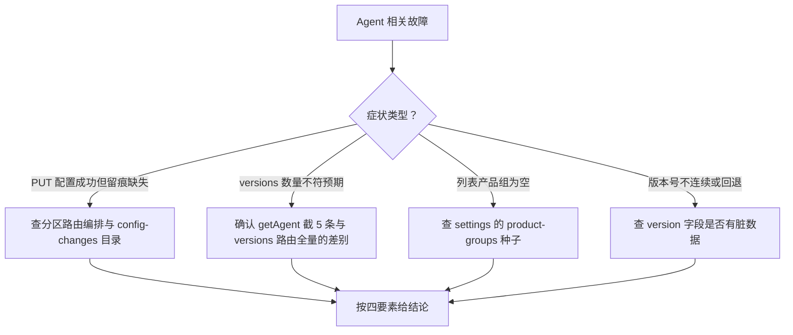

# agent-service 排查

> 蒸馏自 `docs/distilled/agent-service.md` 的排查指南与已知坑。组件事实与接口读 `references/agent-service-component.md`。

## 何时读

Agent 配置保存异常、版本条目数量与预期不符、列表产品组为空、配置留痕缺失、版本号不连续等故障定位时读本篇。

## 排查路径

### 问题现象

- 列表页「所属产品组」显示为空。
- 创建 Agent 报 404「产品组不存在」。
- 配置 version 数字不连续或回退。
- PUT 配置成功但 config-changes 无记录。
- 想找回「已删除」的 Agent。
- 列表分页或搜索结果不符合预期；详情页 versions 只显示 5 条。
- 并发编辑同一 Agent 时配置互相覆盖。

### 关键信息和关键报错

- 404 文案「产品组不存在」来自 createAgent 的前置校验（`apps/web/lib/services/agent-service.ts:83-87`）。
- 配置 version 自增用 `Number(existing.version) || 0`（`apps/web/lib/services/agent-service.ts:167`）：version 非数字（字符串脏数据）时从 0 重新起算。
- 审计动作名 `agent.config.update` 与 `agent.archive`；config-changes 文件在 `data/config-changes/` 目录。
- 软删除仅置 status 为 ARCHIVED（`apps/web/lib/services/agent-service.ts:144`），文件仍在 `data/agents/` 下。

### 排查建议

| 症状 | 先看哪里 |
|------|---------|
| 产品组显示为空 | withProductGroup 未命中：productGroupId 在 settings/product-groups.json 无对应项时返回 null（`apps/web/lib/services/agent-service.ts:28-34`） |
| 创建报 404 产品组不存在 | 先确认 settings/product-groups.json 种子里有该产品组 |
| version 数字不连续 | version 字段是否曾被写成非数字字符串（从 0 起算，`apps/web/lib/services/agent-service.ts:167`） |
| PUT 成功但无 config-change | 留痕由路由层编排（`apps/web/app/api/agents/[id]/config/[partition]/route.ts:79`）；绕过该路由直调 service 不会有记录 |
| 找回已删 Agent | 软删除文件还在，把 status 从 ARCHIVED 改回即可 |
| 分页搜索不符预期 | 过滤与排序全在 store.queryList（`apps/web/lib/data/store.ts:107-122`），search 只匹配 name 与 description（`apps/web/lib/services/agent-service.ts:47-53`） |
| versions 只有 5 条 | getAgent 聚合做了截断（`apps/web/lib/services/agent-service.ts:70-73`）；完整历史走 versions 路由 |

### 解决建议

- 产品组为空：补齐 settings/product-groups.json 对应条目，或修正 agent 的 productGroupId。
- 留痕缺失：确认写入路径经过分区配置路由编排，不要绕过路由直调 service。
- 并发覆盖（已知坑 1）：多操作者同时编辑同一 Agent 分区时需人工协调，落地序列以最后写入者为准。
- 列表变慢（已知坑 2）：withProductGroup 逐行重读产品组文件，数据量大时考虑优化读取方式。

## 红旗

排查结论若需要改动留痕编排或软删除语义，先回到 `references/agent-service-component.md` 的设计原理确认动因，不要只按症状打补丁。
