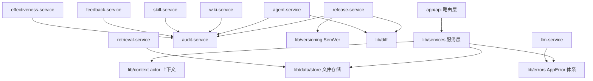
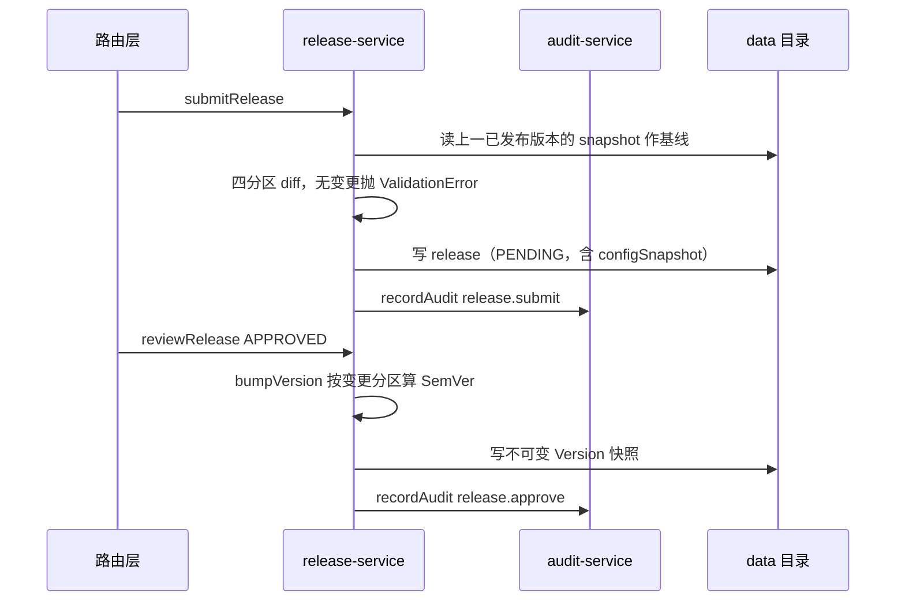

# 架构契约与全景

> 蒸馏自 `docs/distilled/services-overview.md`（apps/web 服务层模块级总览）。单服务细节见 hub 路由表的各服务 stub。

## 何时读

需要回答跨服务问题：服务层在应用中的位置、9 个服务分工、四条全层契约、发布主线数据流、抽层的演进动因。单服务职责或单服务故障排查时读对应服务 stub。

## 服务层边界

服务层夹在 `app/api` 路由层与 `lib` 基础设施之间：路由层只做参数校验与 actor 装配，业务规则全部下沉服务层；服务层不感知 HTTP，只依赖 store、context、errors 等基础设施。下图的边只画直接 import：

audit-service 是全层唯一被横向依赖的服务（agent / wiki / skill / feedback / release / effectiveness 六个服务 import 其 `recordAudit`，锚点如 `apps/web/lib/services/agent-service.ts:4`、`apps/web/lib/services/release-service.ts:4`）；llm-service 是唯一不碰 store 的服务，仅依赖错误体系（`apps/web/lib/services/llm-service.ts:9`）。

## 九服务分工

| 服务 | 一句话职责 |
| --- | --- |
| release-service | 发布提交 / 审批 / 整版本回滚，releases 与 versions 两个集合的唯一写入口 |
| agent-service | Agent 实体 CRUD（软删除）与四分区配置草稿读写 |
| wiki-service | 知识库 Vault 与 Page 管理，含唯一的物理删除操作 |
| skill-service | Skill 资产与 Agent 绑定（绑定内嵌于 agent 记录） |
| feedback-service | 反馈收集与八状态流转（白名单状态机） |
| audit-service | 全局 append-only 审计流（fire-and-forget） |
| llm-service | MiMo 网关：无状态 chatCompletion，三档结构化错误 |
| retrieval-service | wiki 页面的 BM25-lite 本地检索 |
| effectiveness-service | 版本效果报告的懒计算与幂等写回 |

## 四条模块间契约

全层共享四条约定，违反任意一条都会破坏跨服务的可预期性：

1. **错误必须走 AppError 体系**。服务层抛 `lib/errors.ts` 的子类（NotFoundError / ValidationError / ConflictError），由路由层统一映射 HTTP 状态；设计动因是消除「靠字符串匹配判 404」的旧模式（`apps/web/lib/errors.ts:1-6`）。
2. **actor 一律从 context 取**。写操作经 `lib/context.ts` 的 `getActor()` 拿操作者，由路由层 `withActor` 装配；动因是替代散落各处的硬编码 "system"（`apps/web/lib/context.ts:1-9`）。既存反例：agents/[id]/skills 路由的 DELETE 未用 withActor 包裹，解绑审计恒署名「系统」（见 skill-service 排查 stub）。
3. **所有写操作记审计**。业务成功后调 `recordAudit`；审计自身失败不影响业务（fire-and-forget），这是刻意设计而非疏漏。
4. **存储统一走 store**。单实体 JSON 文件 + 全量覆盖写（`apps/web/lib/data/store.ts:52-55`）；损坏文件抛结构化错误而非裸异常。既存例外两处：wiki-service 的 pages 目录绕过 store 直接用 fs（listPages 扫描与 deleteVault 递归删除），retrieval-service 读页面也是 fs 直读——新代码不得新增例外。

## 发布主线数据流

平台主线是「改配置 → 发版 → 收反馈 → 再改」的改进环。发布主线的调用顺序：

配套链路：配置草稿改动由 agent-service 落盘并写 config-changes（diff 明细，与审计流分工）；反馈进入 feedback-service 的状态机；反馈的 LLM 归因走 llm-service（insight 路由）、版本效果聚合走 effectiveness-service（versions 路由 lazy fill）；试聊走 chat 路由直接调 llm-service；retrieval-service 当前只被测试引用，属「已建成、未接线」状态。

## 演进动因

- **为什么抽服务层**：路由层保持「校验 + 装配 actor + 调服务 + 错误映射」四件事，业务规则集中在服务层才可被无 HTTP 上下文的单测直接覆盖。
- **为什么错误 / actor 成体系**：errors 与 context 的头部注释各自记录了要替代的旧模式——字符串匹配判 404 与硬编码 "system"。
- **版本号为什么独立成库**：release-service 曾把 major/patch 硬编码为 0、只递增 minor，规则随后抽到 `lib/versioning.ts` 集中管理。
- **证据边界**：git 提交信息在本仓库全部为 "update"，无演进叙事可考；上述动因证据全部来自代码内注释与测试断言，代码内注释属于作者直接留下的动因记录，证据等级最高。
