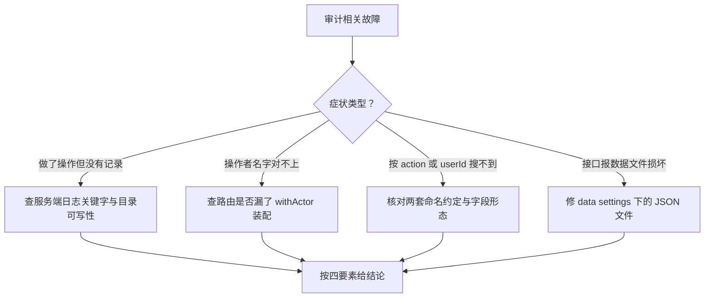

# audit-service 排查

> 蒸馏自 `docs/distilled/audit-service.md` 的排查指南与已知坑。组件事实与接口读 `references/audit-service-component.md`。

## 何时读

做了操作但审计流没有记录、审计署名对不上、按 action 或 userId 搜不到记录、审计文件损坏等故障定位时读本篇。

## 排查路径

### 问题现象

- 明明做了操作，审计流里没有记录。
- 记录的 userName 与实际操作者对不上，或全程显示「系统」。
- 按 action 过滤搜不到记录。
- 按用户 ID 查不到记录。
- 接口报「数据文件损坏」。
- 审计流里出现操作者为「系统」的效果报告记录（version.effectiveness.computed）。

### 关键信息和关键报错

- recordAudit 写失败只打日志，关键字 `[audit] recordAudit failed`（`apps/web/lib/services/audit-service.ts:55-65`）；测试环境下连日志都省略。
- actor 来自请求头 x-actor-*，未传时缺省「系统 / system 角色」（`apps/web/lib/context.ts:29-39`）；路由层漏了 withActor 包裹则全程记为 system。
- action 命名两套约定：service 层点分小写（agent.create），settings 路由层下划线（product_group.create，`apps/web/app/api/settings/product-groups/route.ts:32`）。
- 运行时写入的条目只有 userName/userRole 字段（`apps/web/lib/services/audit-service.ts:49-50`），没有 userId。
- 数组文件被手工改坏时 readArray 抛结构化 AppError（`apps/web/lib/data/store.ts:131-138`）。

### 排查建议

| 症状 | 先看哪里 |
|------|---------|
| 无记录 | recordAudit 吞错设计：查服务端日志关键字，确认 data/settings/ 目录可写 |
| userName 对不上 | 该路由是否漏了 withActor；缺省 actor 就是「系统」 |
| 按 action 搜不到 | 对照两套命名约定（点分小写 vs 下划线）确认搜索词 |
| 按 userId 查不到 | 路由的 userId 别名过滤（`apps/web/app/api/settings/audit-logs/route.ts:18`）只能命中数据里本就有 userId 字段的旧记录，运行时条目没有该字段 |
| 数据文件损坏 | 修复 `data/settings/audit-logs.json` 的 JSON 语法后恢复 |
| 效果报告记录署名「系统」 | 属预期行为：lazy fill 由 GET 触发且路由未装配 actor，不要当成人工操作排查 |

### 解决建议

- 无记录：恢复目录可写权限后重放操作；对审计完整性有硬要求的场景需另行补监控（静默失败无告警通路，已知坑 4）。
- 署名丢失：给漏装配的路由补 withActor（skill 的 unbind 路由是既存反例，见 `references/skill-service-troubleshooting.md`）。
- 查询逻辑变更：改审计查询以 GET /api/settings/audit-logs 路由层为准（listAudit 无生产调用方，两处需人工同步，已知坑 1）。
- 同名区分：审计不含操作者 ID（已知坑 2），追责场景只能到「名字」粒度，需要更细粒度时先改记录结构再谈。

## 红旗

不要把 fire-and-forget 改成同步阻塞来「修」审计丢失——审计失败不回滚业务是刻意设计（见 `references/audit-service-component.md` 设计原理），正确方向是补监控而非改语义。
