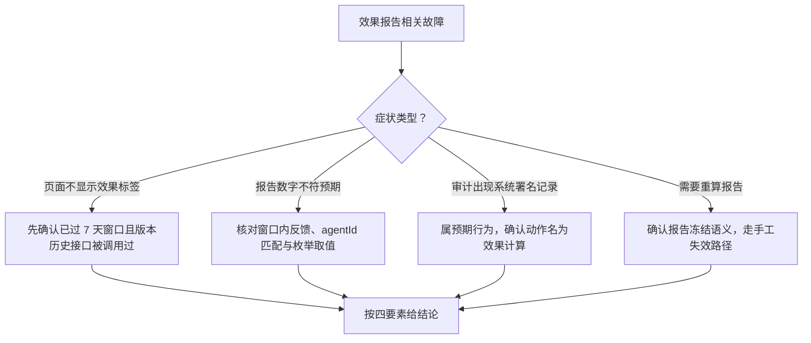

# effectiveness-service 排查

> 蒸馏自 `docs/distilled/effectiveness-service.md` 的排查指南与已知坑。组件事实与接口读 `references/effectiveness-service-component.md`。

## 何时读

效果标签不显示、报告数字与预期不符、需要强制重算、审计流出现「系统」署名效果记录等故障定位时读本篇。

## 排查路径

### 问题现象

- 版本详情页不显示效果标签。
- 报告数字与预期不符（偏少或与最新反馈对不上）。
- 审计流里出现操作者为「系统」的效果报告记录。
- 想强制重算但找不到入口。
- 版本历史接口偶发变慢。

### 关键信息和关键报错

- 未到窗口时 getOrCompute 返回 null，这是 null 的唯一含义（`apps/web/lib/services/effectiveness-service.ts:144-151`）；前端只在 publishedAt 距今满 7 天后展示效果标签。
- 报告只统计窗口内且 agentId 匹配的 feedback（`apps/web/lib/services/effectiveness-service.ts:90-95`）；rating/severity/targetPartition 三组枚举之外的值静默丢弃（`apps/web/lib/services/effectiveness-service.ts:101-111`）。
- 报告在窗口关闭后计算一次即冻结（effectivenessReport 非空即短路，`apps/web/lib/services/effectiveness-service.ts:142`），窗口关闭后新增的 feedback 永不进入。
- 审计动作名 version.effectiveness.computed，由 GET 触发且路由未装配 actor，署名恒为「系统」（`apps/web/lib/services/effectiveness-service.ts:167-171`）。

### 排查建议

| 症状 | 先看哪里 |
|------|---------|
| 不显示效果标签 | 先确认已过窗口；再确认版本历史接口被调用过一次（lazy fill 只在读时触发，没有后台任务兜底） |
| 数字与预期不符 | 报告是计算时点的快照且永不重算；核对反馈的提交时间是否真落在窗口内；核对枚举值是否在三组合法枚举内 |
| 审计「系统」记录 | 属预期：排查审计时不要把它当成人工操作 |
| 强制重算 | 没有重算入口；只能手工编辑 `data/versions/<id>.json` 删掉 effectivenessReport 字段后再 GET |
| 版本历史接口慢 | 每次计算全量扫 feedback，版本历史路由逐 version 循环调用，最坏成本为版本数与反馈数的乘积（`apps/web/app/api/agents/[id]/versions/route.ts:34-37`） |

### 解决建议

- 标签不显示：等窗口期满后访问一次版本历史即可触发；不要为此加定时任务（lazy fill 是刻意取舍）。
- 数字存疑：确认数据本身后接受快照语义；确需刷新只能手工删字段触发重算，注意这会重置冻结时点。
- 并发双写（已知坑 4）：数据无害（全量覆盖、纯函数输出相同），审计流出现两条 version.effectiveness.computed 可忽略或合并。
- 性能（已知坑 2）：新 agent 多版本集中过窗口时首读成本线性上涨，接线上量前需重估全量扫描。

## 红旗

「报告永不重算」没有在代码注释中声明，属于实测确认的语义——不要想当然认为报告会随反馈更新；任何依赖报告新鲜度的功能都要先过这一条。
