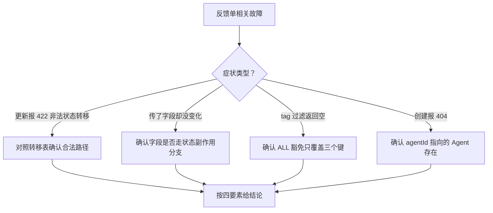

# feedback-service 排查

> 蒸馏自 `docs/distilled/feedback-service.md` 的排查指南与已知坑。组件事实、状态机全貌与接口读 `references/feedback-service-component.md`。

## 何时读

状态迁移被拒、PUT 字段不生效、tag 过滤返回空、终态反馈行为异常等故障定位时读本篇。

## 排查路径

### 问题现象

- 更新报 422「非法状态转移：X 到 Y」。
- PUT 传了 assignedTo 或 verificationNote 但字段没有变化。
- 反馈已 CLOSED，想重新打开。
- 列表里 agent 列为空。
- tag 过滤传 ALL 查不到数据。
- 创建反馈报 404「Agent 不存在」。
- 终态反馈的 severity、resolution 等字段还能改。

### 关键信息和关键报错

- 422 来自 assertTransition 抛出的 ValidationError（`apps/web/lib/services/feedback-service.ts:29-34`），details.allowed 给出当前状态的合法去向。
- assignedTo 只在 status 同步置为 ASSIGNED 时写入（`apps/web/lib/services/feedback-service.ts:146-149`），verificationNote 同理跟随 VERIFIED（`:150-153`）；单独传会被静默丢弃。
- CLOSED / WONTFIX 的转移表为空数组（`apps/web/lib/services/feedback-service.ts:22-23`），无重开路径；但同状态放行（`:27`）意味着非状态字段在终态后仍可改。
- withAgentName 未命中时 agent 摘要为空：agentId 指向的 agent 已不存在（`apps/web/lib/services/feedback-service.ts:37-40`）。
- 创建 404 来自 createFeedback 的 agent 存在性校验（`apps/web/lib/services/feedback-service.ts:93-94`）。

### 排查建议

| 症状 | 先看哪里 |
|------|---------|
| 422 非法状态转移 | 对照 details.allowed 与状态机确认路径；两条回退边只有 RESOLVED 回 IN_PROGRESS、VERIFIED 回 IN_PROGRESS |
| assignedTo 没生效 | 确认 PUT 是否同时把 status 转到 ASSIGNED；单独传字段被丢弃 |
| 终态重开 | 无重开路径（转移表为空）；severity 等非状态字段终态后仍可改 |
| agent 列为空 | 该反馈的 agentId 指向的 Agent 已不存在（软删除同样导致未命中） |
| tag 传 ALL 返回空 | ALL 豁免只覆盖 status/severity/rating（`apps/web/lib/services/feedback-service.ts:55-63`），tag 需前端单独处理 |
| 创建 404 | 确认 agentId 真实存在且未归档 |

### 解决建议

- 状态跳跃被拒：按合法路径分多步转移（NEW 先到 TRIAGED 再到后续状态），不要试图一次到位。
- assignedTo 丢失：把 assignedTo 与 status ASSIGNED 放进同一次 PUT；verificationNote 与 status VERIFIED 同理。
- 终态字段可改：这是设计现状（状态锁非只读锁），若业务要求冻结需先改通用合并逻辑再谈。
- tag 过滤：前端对 tag 维度不传 ALL 或传真实标签值。

## 红旗

给反馈单加新状态或新转移边时，唯一事实源是 ALLOWED_TRANSITIONS 常量表（`apps/web/lib/services/feedback-service.ts:15-24`）——只改前端不改编译不过的转移表，或改编译表不改状态副作用分支，都会制造静默不一致。
