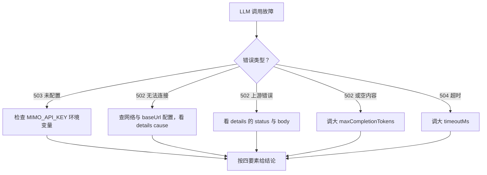

# llm-service 排查

> 蒸馏自 `docs/distilled/llm-service.md` 的排查指南与已知坑。组件事实与接口读 `references/llm-service-component.md`。

## 何时读

LLM 调用报 503 / 502 / 504、模型返回空内容、需确认 LLM 是否可用等故障定位时读本篇。

## 排查路径

### 问题现象

- 接口报 503「LLM 未配置」。
- 报 502「无法连接 LLM 服务」。
- 报 502「LLM 上游错误」并附 HTTP 状态码。
- 返回「模型返回空内容」。
- 报 504 超时。
- 想确认 LLM 当前是否可用。

### 关键信息和关键报错

- 503 直接指向 MIMO_API_KEY 未设置（`apps/web/lib/services/llm-service.ts:57`、`:74`）；monorepo 子应用的 env 加载范围另见部署文档。
- 502 连接失败时 details.cause 里有原始错误消息（`apps/web/lib/services/llm-service.ts:94-96`）；上游非 2xx 时 details.status 与 details.body（截断 300 字符，`:100-104`）——401 对应鉴权失败、429 对应限流。
- 空内容错误的文案点名成因：reasoning tokens 吃满 max_completion_tokens（头注释预警 `:6-7`，错误点 `:118-122`）。
- 504 的默认超时是 120 秒（`:52`）。
- 三档错误类的 code 都是 INTERNAL，监控聚合或前端分支要按 HTTP status 区分，不能按 code。

### 排查建议

| 症状 | 先看哪里 |
|------|---------|
| 503 未配置 | 三个 MIMO env 是否设置（尤其 MIMO_API_KEY）；确认 env 在正确的应用目录生效 |
| 502 无法连接 | 网络 / DNS / baseUrl 配错；details.cause 有原始错误 |
| 502 上游错误 | details.status 与 details.body；401 鉴权、429 限流分别处理 |
| 空内容 | 调大调用方的 maxCompletionTokens（预算被推理耗尽） |
| 504 超时 | 长输出场景传更大的 timeoutMs（默认 120 秒） |
| 确认可用性 | GET 探测路由看 configured 字段（`apps/web/app/api/maas/probe/route.ts:16`） |
| 同一 502 分不清成因 | 空 content 与响应解析失败被压成同一错误且无 details（已知坑 1）——看服务端日志定位 |

### 解决建议

- 503：设置 MIMO_API_KEY（必要时连同 MIMO_BASE_URL / MIMO_MODEL）后重启生效。
- 502 连接类：修正 baseUrl 或网络；上游抖动类：等上游恢复——本服务无重试无熔断（已知坑 4），兜底在调用方侧。
- 空内容：为推理模型显式传足 maxCompletionTokens，不要依赖默认 2048（已知坑 2）。
- 504：长输出请求调大 timeoutMs；持续 504 优先怀疑上游而非本服务。
- 延迟监控：latencyMs 含请求序列化与网络（已知坑 5），做上游性能监控时不要直接当上游耗时用。

## 红旗

给四个业务调用方加重试时注意：502/504 原样透传是设计现状，但 429 限流场景盲目重试会放大压力——退避策略在调用方实现，不在 llm-service 内。
