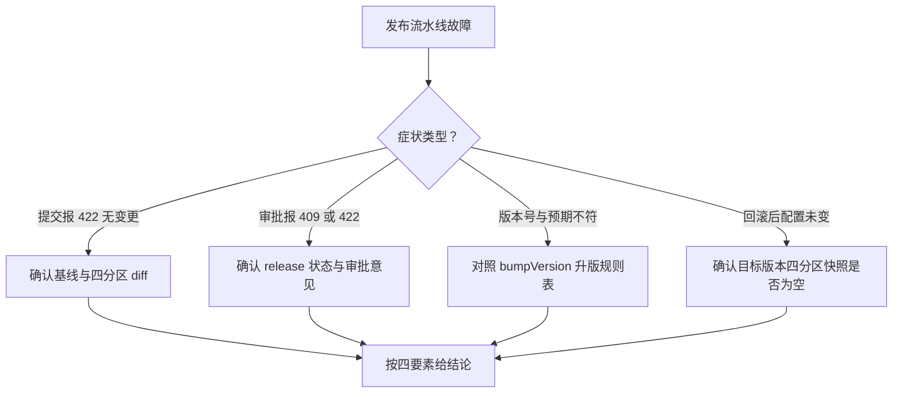

# release-service 排查

> 蒸馏自 `docs/distilled/release-service.md` 的排查指南与已知坑。组件事实、状态机与接口读 `references/release-service-component.md`。

## 何时读

发布提交被拒、审批报错、版本号与预期不符、回滚行为不符预期等故障定位时读本篇。

## 排查路径

### 问题现象

- 提交报 422「没有任何配置变更，无法提交发布」。
- 审批报 409「该 Release 已处理」。
- CHANGES_REQUESTED 报 422。
- 版本号与预期不符（升 major 或该升 minor 没升）。
- 回滚后 agent 配置未变。
- 审计日志缺一条发布动作记录。
- 版本历史里出现「高版本号内容等于旧版本」。

### 关键信息和关键报错

- 422 无变更：三桶 diff 全空（`apps/web/lib/services/release-service.ts:56-68`）；基线是最近已发布版本快照（`:28-54`）。刚回滚过就提交会被拒——当前配置与快照一致，属预期行为。
- 409 已处理：status 非 PENDING 即拒绝（`:145-147`），三个终态都不可再变。
- CHANGES_REQUESTED 的 422：reviewComment 为空或纯空白（`:148-150`）。
- 版本号规则：ROUTING 分区变更或不少于 2 个分区升 minor；单个非路由分区升 patch；全部 4 分区变更也是 minor 而非 major（`apps/web/lib/versioning.ts:46-69`）。
- 回滚配置未变：目标 Version 的 4 个快照字段为空时兜底为空对象（`:283-284`）。
- 审计缺一条：recordAudit 是 fire-and-forget，写失败只打日志不阻塞业务（`apps/web/lib/services/audit-service.ts:55-65`）。

### 排查建议

| 症状 | 先看哪里 |
|------|---------|
| 提交 422 无变更 | 确认相对「最近已发布版本」是否真有变更；刚回滚过就提交被拒属预期 |
| 审批 409 | 该 release 已进终态；不能重复审批，重新走提交流程 |
| 意见校验 422 | reviewComment 必须非空白 |
| 版本号不符 | 对照规则表确认变更分区组合；全 4 分区也是 minor，永不自动 major |
| 回滚未生效 | 目标 Version 的分区快照字段是否为空（空则兜底空对象，`:283-284`） |
| 审计缺记录 | 按 audit-service 排查 stub 的「无记录」路径走，不要在 release-service 里找 |
| 版本内容看似回退 | 这是回滚不回退版本号的设计（`:314-318`），版本号只增不减 |

### 解决建议

- 无变更被拒：先改配置再提交；回滚后确需再发布，先做一个真实变更。
- 乱序审批时间线错位（已知坑 1）：审批前确认 release 的提交时间与内容对应关系，版本号大小不代表配置新旧。
- 版本历史响应过大（已知坑 5）：长期运行的 agent 版本只增不减且全量返回，接线上量前需给 versions 路由加分页。
- 列表逻辑变更：listReleases 无生产调用方，GET /api/releases 在路由层内联实现（已知坑 3）——改列表行为时两处人工同步。
- SemVer 脏数据：双实现容错语义不同（已知坑 4），修 versioning 侧不代表 compareSemVer 侧行为一致，两处都要核。

## 红旗

不要试图给回滚「补版本号回退」或让回滚走 PENDING 审批——回滚立即派生新版本、直接 APPROVED 是刻意设计（历史快照不可变 + 紧急恢复语义）；相关取舍见 `references/release-service-component.md` 关键决策 7 与 8。
