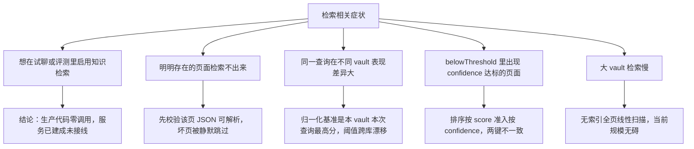

# retrieval-service 排查

> 蒸馏自 `docs/distilled/retrieval-service.md`。按症状进入对应排查路径，先定位再动手。

## 何时读

- 知识检索行为不符合预期（检索不到、评分漂移、结果截断）时。
- 评估是否把 searchWiki 接进试聊或评测链路时。

## 排查路径

### 问题现象

1. 想在试聊或评测里启用知识检索，发现没有任何检索结果注入。
2. 某个页面在数据目录里存在，检索结果里却永远没有它。
3. 同一个查询加同一个 confidenceThreshold，在小 vault 与大 vault 上松紧表现完全不同。
4. belowThreshold 数组里混有 confidence 已达标的页面。
5. results 被评分靠前但 baseConfidence 偏低的页面占满，更"相关"的页面反而落选。
6. 页面数或查询长度上来后检索耗时线性恶化。

### 关键信息和关键报错

- 服务**永不抛错**：空入参、空 vault、零命中一律返回 fallbackTriggered 为 true 的空结果（`retrieval-service.ts:143-150`、`retrieval-service.ts:200`）——排查时不要等异常，要读返回结构。
- strategy 恒为字符串 BM25_LITE，candidates 是参与打分的页面数（`retrieval-service.ts:197`），excerpt 固定取 content 前 400 字符（`retrieval-service.ts:182`）。
- 坏 JSON 页面在 loadPages 被静默跳过（`retrieval-service.ts:109-114`），无日志、不影响 candidates 计数。
- 数据根硬编码 `process.cwd()/data`（`retrieval-service.ts:104`），自定义数据根后检索不到任何数据。
- 排序与准入是两把尺子：score 降序排（`retrieval-service.ts:170`），confidence 判定进 results（`retrieval-service.ts:186`）。

### 排查建议

| 症状 | 先看哪里 | 结论 |
|------|---------|------|
| 想启用知识检索 | 试聊路由是否 import 本模块 | 未接线（`retrieval-service.ts:4-5` 的 docstring 是虚构调用方），需自行接入 searchWiki 并消费 usedInContext 的页面 |
| 页面检索不出来 | 该页 JSON 能否解析 | 解析失败被静默跳过（坑 3），先修文件再重试 |
| 跨库表现差异大 | 归一化实现 | vault 内相对分（`retrieval-service.ts:158-160`），固定阈值做多库统一过滤语义会漂移 |
| belowThreshold 混有达标页 | 排序与准入键 | 两键不一致（坑 4），名额被 score 靠前但 baseConfidence 低的页面占掉 |
| 自定义数据根后检索为空 | 数据根解析 | 硬编码 cwd（`retrieval-service.ts:104`），不读 store 的 dataDirOverride |
| 大 vault 检索慢 | 打分循环 | 无索引线性扫描（`retrieval-service.ts:125-129`），接线上量前需重估 |

### 解决建议

- 接线前先给 searchWiki 的返回结构写消费约定：results 只含 usedInContext 为 true 的页面，belowThreshold 仅供审计不要直接注入上下文。
- 修坏 JSON 页面时对照同目录其他页面的字段形态；修完后用 candidates 数验证参与打分的页面数是否恢复。
- 跨库比较或统一阈值场景，先固定每个 vault 的语料规模与 baseConfidence 分布，再解释 confidence。
- 把 loadPages 的静默跳过改成计数上报（candidates 与磁盘页面数对账），可在不改变算法的前提下暴露覆盖率缩水。

## 红旗

- 不要把 docstring 声称的试聊与评测调用方当真——生产零调用是当前事实，改架构前先确认接线点。
- 不要给 belowThreshold 强加"低于阈值"语义——它混有达标但超额的页面。
- 不要把 confidence 当绝对分跨 vault 比较——它是 vault 内归一化的相对分。
