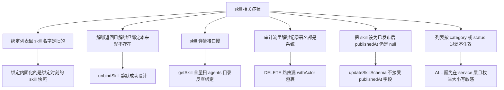

# skill-service 排查

> 蒸馏自 `docs/distilled/skill-service.md`。按症状进入对应排查路径，先定位再动手。

## 何时读

- 技能绑定、解绑、详情聚合行为不符合预期时。
- 审计流里 skill 相关记录署名或缺失异常时。

## 排查路径

### 问题现象

1. skill 改过名，绑定列表里显示的还是旧名字。
2. 解绑接口返回"已解绑"，但该 agent 本来就没绑这个 skill。
3. skill 详情接口响应明显偏慢，agent 文件越多越慢。
4. 审计流里解绑记录的操作者都是"系统"，看不出真实操作人。
5. 通过 API 把 skill 状态设为 PUBLISHED 后，publishedAt 字段仍是 null。
6. 列表按 category 或 status 过滤没反应。
7. 绑定了一个已 ARCHIVED 的 skill，绑定照样成功。

### 关键信息和关键报错

- binding 内固化的是绑定时刻的 skill 快照（`skill-service.ts:153`），skill 改名后不刷新，getAgentSkillBindings 原样返回（`skill-service.ts:192`）。
- unbindSkill 对不存在的绑定静默成功，filter 无命中照常写回并返回 deleted 为 true（`skill-service.ts:173-184`）。
- getSkill 每次详情都全量读 agents 目录再逐个翻 skillBindings（`skill-service.ts:41-48`）。
- 解绑审计署名问题出在路由层：POST 用了 withActor 包裹，DELETE 直接调 service（`route.ts:40`），recordAudit 兜底为 SYSTEM_ACTOR（`context.ts:18-22`）。
- updateSkillSchema 允许把 status 设为 PUBLISHED 或 DEPRECATED，但不接受 publishedAt 字段；service 层也没有发布动作写它（`skill-service.ts:90` 恒 null）。
- category 与 status 传字符串 ALL 视为不过滤（`skill-service.ts:16-21`），枚举值大小写敏感。
- bindSkill 只校验 skill 文件存在（`skill-service.ts:131-132`），不校验 status，ARCHIVED 的 skill 仍可绑定。

### 排查建议

| 症状 | 先看哪里 | 结论 |
|------|---------|------|
| 绑定列表名字旧 | binding 快照机制 | 快照固化设计（坑 5），重新绑定可刷新，或手工修 agents 数据 |
| 解绑假成功 | 先 GET 绑定列表确认真实状态 | unbindSkill 静默成功设计（坑 2），接口无法区分两种情况 |
| 详情接口慢 | agents 目录文件数 | 全量扫 agents 反查是主要成本（坑 6），详情页高频路径需重估 |
| 解绑审计署名系统 | 解绑路由的 DELETE 分支 | 漏 withActor 包裹（坑 7），对照同文件 POST 的正确写法 |
| publishedAt 恒 null | updateSkillSchema 字段表 | schema 不接受该字段且无发布动作写它（坑 4），只有种子数据非空 |
| 过滤不生效 | 请求参数值 | 确认是否传了 ALL（视为不过滤）、枚举大小写是否正确 |
| ARCHIVED skill 可绑定 | bindSkill 存在校验 | 只查存在不查状态（坑 5），属已知行为 |

### 解决建议

- 要刷新绑定快照：对受影响 agent 逐个重新 bindSkill（幂等 upsert 会合并 config 并保留记录），或直接修 agents 目录下的 JSON。
- 解绑前先调 GET 绑定列表确认存在性；需要严格语义的话在调用方自行比对 deleted 返回与 GET 结果。
- 修审计署名：给解绑路由的 DELETE 分支补 withActor 包裹 resolveActor，对照同文件 POST 写法。
- 要发布动作真正生效：在 schema 放开 publishedAt 并在 service 层补发布函数，当前状态字段与时间戳是脱节的。
- toggleSkillBinding 若要接上路由：先补 recordAudit（当前无审计），再暴露端点。

## 红旗

- 不要把"已解绑"响应当作绑定曾经存在的证据——静默成功设计下它也可能是空操作。
- 不要依赖 binding 内快照做实时判断——它是绑定时刻的冻结值。
- 不要绕过路由 schema 直调 service 的 updateSkill——全量展开没有字段白名单。
