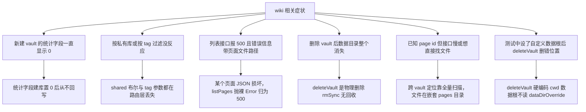

# wiki-service 排查

> 蒸馏自 `docs/distilled/wiki-service.md`。按症状进入对应排查路径，先定位再动手。

## 何时读

- 知识库列表、统计、过滤、删除行为不符合预期时。
- 涉及 wiki 数据文件损坏或数据根路径异常时。

## 排查路径

### 问题现象

1. 新建 vault 后页面数、平均置信度、孤立页一直显示 0。
2. GET 请求带 shared 为 false 想只看私有库，过滤不生效。
3. 页面列表按 tag 过滤没反应。
4. 列表接口报 500，错误信息里带着 pages 目录下某个 JSON 文件的路径。
5. 删除 vault 后数据目录整个消失，没有回收站。
6. 已知 page id 但定位接口慢，或想直接在磁盘上找页面文件。
7. 测试里通过 store 的 override 设了自定义数据根，deleteVault 还是去删默认位置。

### 关键信息和关键报错

- vault 统计字段 pageCount、avgConfidence、orphanCount 只在 createVault 时初始化为 0（`wiki-service.ts:47-49`），页面增删从不回写；前端读的是静态值，只有种子库数据非零。
- shared 过滤：service 层支持布尔（`wiki-service.ts:17`），但 vaults 路由只把字符串 true 映射为 true，其余一律 undefined（vaults 路由 `route.ts:11`）。
- tag 过滤：service 层实现了（`wiki-service.ts:116-118`），但 pages 路由根本没解析 tag 参数（pages 路由 `route.ts:11-15`）。
- listPages 遇坏 JSON 抛裸 Error（`wiki-service.ts:106`），错误映射只认 AppError，裸错误归为 500 且 message 原样透出。
- deleteVault 递归删整个 vault 目录（`wiki-service.ts:76-80`），物理删除无软删，只有 wiki.vault.delete 一条审计记录。
- getPage、updatePage、deletePage 跨 vault 定位都全量扫 vaults 逐个试读（`wiki-service.ts:134-140`）；页面文件物理位置在 data 目录下 wiki-vaults 里的 vaultId 子目录 pages 下的 pageId JSON。
- deleteVault 硬编码 `process.cwd()/data`（`wiki-service.ts:76`、`wiki-service.ts:79`），不读 store 的 dataDirOverride（`store.ts:10-13`）。

### 排查建议

| 症状 | 先看哪里 | 结论 |
|------|---------|------|
| 统计恒为 0 | 统计字段的回写路径 | 字段是静态快照（坑 2），页面操作不回写，属已知行为非数据丢失 |
| shared 为 false 不生效 | vaults 路由参数解析 | 只认字符串 true（坑 5），私有库过滤无法经 API 表达，需客户端自筛 |
| tag 过滤没反应 | pages 路由参数解析 | 路由未解析 tag（坑 6），service 层参数是死的 |
| 列表 500 带文件路径 | 报错信息里的 JSON 文件 | 该页面文件损坏（坑 4），修复文件或移除后重试 |
| 删除后目录消失 | deleteVault 实现 | 物理删除设计（坑 1），恢复只能靠备份或种子 |
| 定位接口慢或找不到文件 | 数据物理布局 | 全量扫描是当前实现（坑 3），文件在 vault 嵌套 pages 子目录 |
| 自定义数据根下删错位置 | 数据根解析 | deleteVault 绕过 override（坑 1），测试与部署需避开或先修此缺陷 |

### 解决建议

- 修坏 JSON 页面时对照同目录其他页面的字段形态；修复后 listPages 立即恢复，无需重启。
- 让统计字段活起来需要在 createPage、deletePage、updatePage 里回写 vault 文件——改动前先确认前端展示依赖的是这三个字段还是实时计算。
- 私有库过滤短期用客户端自筛；长期修法是 vaults 路由把字符串 false 也映射为布尔。
- tag 过滤短期走 search 参数替代；长期修法是 pages 路由补 tag 参数解析。
- 涉及 deleteVault 的测试或部署，先确认数据根：它永远删默认 cwd 下的 data 目录，不跟随 store 的 override。

## 红旗

- 不要把 wiki 的删除当软删——vault 与 page 都是物理删除，与 agent、skill 的归档约定相反，动手前先备份。
- 不要用 page.vaultId 假设有索引直达——当前三个跨 vault 接口都是全量扫描。
- 不要在自定义数据根场景下触发 deleteVault——硬编码路径会删错位置。
